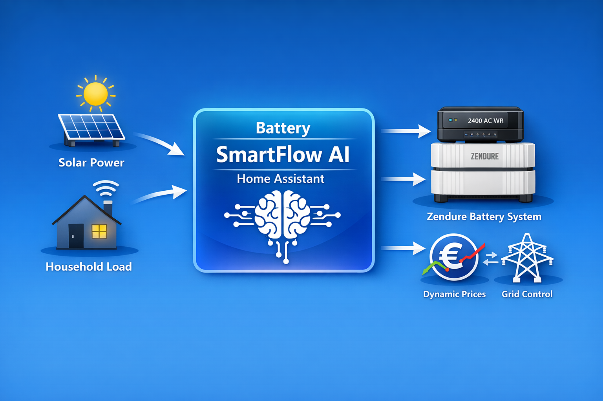
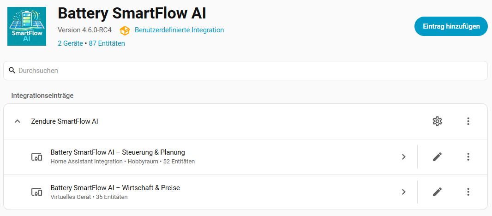
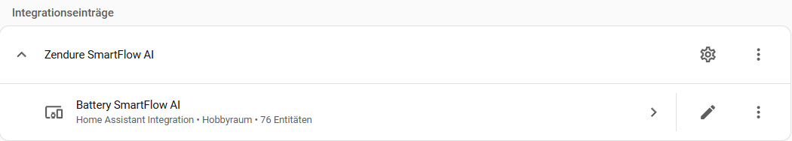
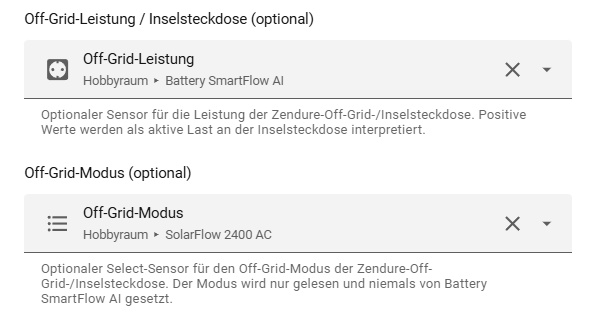

# Battery SmartFlow AI CKW

---

## Unterstützung

Battery SmartFlow AI ist ein privates Freizeitprojekt. Wenn dir die Integration hilft und du die weitere Entwicklung unterstützen möchtest, freue ich mich über eine kleine Unterstützung:

---

**Intelligent, economic and stable control for Zendure SolarFlow systems in Home Assistant**

*Note: Currently, only a single battery system is supported. Support for coordinated multi-battery systems is planned for a later major version.*

---

# 🌍 Language

* 🇬🇧 English
* 🇩🇪 Deutsch
* 🇫🇷 French
* 🇳🇱 Dutch

---

## What does this integration do?

**Battery SmartFlow AI** automatically controls your Zendure SolarFlow system – based on:

* ☀️ PV generation
* 🏠 Real household load
* 🔋 Battery SoC
* 💶 Dynamic electricity prices (optional)
* 🌦️ PV forecast data (optional)
* 🧠 Learned consumption and charge-window planning
* ⚙️ Device-specific control profiles
* 🧩 Optional additional battery and off-grid socket detection

The integration combines this data into a **physically stable and economically optimized charging and discharging strategy**.

Goal:

> Minimal grid import.
> Maximum economic efficiency.
> Stable charging and discharging.
> No hectic INPUT/OUTPUT direction changes.

---

# 🧠 Core functions / unified architecture

* Adaptive peak detection for expensive price windows
* Price pre-planning with valley detection
* Learned charge-window planning based on historic household consumption
* Optional PV forecast integration
* Dynamic grid regulation instead of simple full-power switching
* Unified power regulation with grid history, mode arbitration and smoothed power control
* Device profiles per Zendure model
* Automatic device-specific limits and regulation parameters
* Hard-sync with real Zendure AC mode
* Focused status and transparency sensors
* Persistent energy-flow accounting and economic balance
* Profit / savings calculation and economic efficiency
* Season-neutral automatic strategy with seasonal context
* Optional additional battery detection
* Optional off-grid / island socket support
* Optional cell-voltage protection

---

# ✨ V4.6.0 – Economics, prices and a clearer UI

V4.6.0 adds a complete, persistent view of the battery's energy flows and
economic result. Home Assistant now presents the integration as two clearly
arranged devices while both remain part of one shared control system:

* **Control & Planning** – operating mode, power control, charge planning,
  protection and technical diagnostics
* **Economics & Prices** – current prices, thresholds, energy flows, costs,
  revenue, battery benefit and economic efficiency

New and improved capabilities include:

* daily and persistent totals for grid-to-battery, PV-to-battery,
  battery-to-home, battery-to-grid and grid-export energy
* separate grid charging cost, PV opportunity cost, avoided grid cost and
  feed-in revenue
* battery benefit for today and since accounting started
* economic efficiency since start, distinct from the battery's technical
  conversion efficiency
* understandable percentage controls for **Peak price markup** and **Valley
  price discount** instead of technical multipliers
* explicit peak, valley, effective and economic discharge thresholds
* bounded JSON debug recordings that can be exported for support without
  permanently filling Home Assistant Recorder with large diagnostic attributes
* schedulable debug recordings through the existing Home Assistant start and
  stop actions
* compact **Control context: PV / Price / Manual** instead of misleading
  summer and winter labels

Existing settings, learned data and accumulated economic values are preserved
when updating. The detailed meaning of every new value is explained in the
[English user guide](docs/user-guide.md).

---

# ⚠️ Mandatory prerequisites

For the integration to work correctly, the following points **must** be fulfilled:

---

## 1️⃣ Zendure original app

In the Zendure app:

* Charge power → Maximum
* Discharge power → Maximum
* HEMS → disabled
* No parallel automations

⚠️ Control takes place exclusively via Home Assistant.

---

## 2️⃣ Zendure Home Assistant integration

The following settings are mandatory:

* The P1 sensor may be selected during initial Z-HA setup
* Energy export: **Allowed**
* Afterwards: Z-HA Manager → Operating mode **OFF**, so Z-HA does not regulate
  in parallel with BSFAI

The screenshot uses a German interface; `Betriebsmodus: Aus` corresponds to
`Operating mode: Off`.

Incorrect settings may lead to:

* Blocked AC modes
* Discharge interruptions
* Unstable regulation
* Unexpected INPUT/OUTPUT behavior

---

## 3️⃣ Configure grid sensor correctly

Recommended:

* Split mode with separate import & export
  (for example Shelly Pro 3EM)

Supported:

* No grid sensor
* One combined sensor with positive import / negative export
* Two separate sensors for import and export

For best regulation quality, a stable local grid power source is recommended.

---

## 4️⃣ Electricity price integration (optional)

Supported price sources include:

* Tibber
* EPEX
* Octopus Energy, including German Forecast API

Without an electricity price, PV- and load-based control still works.

---

## 5️⃣ PV forecast integration (optional)

PV forecast sensors are optional.

They can improve charge planning, but Battery SmartFlow AI can also run without forecast data.

Supported forecast sources depend on the sensors you provide, for example:

* Solcast PV Forecast
* Other Home Assistant sensors exposing today's and tomorrow's PV forecast

---

# 🛠 Installation (HACS)

1. Open HACS
2. Search for `Battery SmartFlow AI`
3. Download it
4. Restart Home Assistant

---

# ⚙️ Configuration

After installation:

**Settings → Devices & Services → Add Integration → Battery SmartFlow AI**

---

## 1️⃣ Main configuration

Here you select:

* Device profile
* Battery SoC sensor
* Battery AC power sensor
* PV power sensor
* Native battery PV power sensor (optional, for directly connected modules)
* Electricity price (optional)
* Price history / forecast (optional)
* PV forecast today / tomorrow (optional)
* Zendure AC mode
* Charge & discharge entities
* Grid mode
* Additional battery charge/discharge sensors (optional)
* Off-grid / island socket sensors (optional)
* SoC limit status sensor (optional)

📖 Detailed explanations can be found in the **manual**.

---

## 2️⃣ Grid measurement

You can choose between:

* No grid sensor
* One combined sensor (+/-)
* Two sensors (import & export)

Recommended: **two separate sensors**.

---

## 3️⃣ Split sensor selection

When using split mode, select:

* Grid import
* Grid export

separately.

---

## 4️⃣ Expert mode

The expert menu provides access to:

* Learned charge-window planning
* Cell-voltage protection

The unified power regulation is the mandatory command path for all installations.

---

## 5️⃣ Off-grid / island socket configuration

For Zendure systems with an off-grid / island socket, optional sensors can be configured:

* Off-grid power
* Off-grid mode

The off-grid mode is only read by Battery SmartFlow AI. It is **never** controlled or changed by the integration.

Positive off-grid power values are interpreted as an active load at the island socket.

---

# ⚙️ Device profiles

The integration uses model-dependent control parameters.

Currently supported profiles include:

* SolarFlow 800 Pro
* SolarFlow 800 Pro 2
* SolarFlow 1600 AC
* SolarFlow 2400 AC
* SolarFlow 2400 AC+
* SolarFlow 2400 Pro
* Hyper 2000
* HUB 2000

The profile influences, among other things:

* Hardware input/output limits
* Target grid import
* Regulation speed
* Export guard
* Charge and discharge step limits
* Stable import/export cycle thresholds
* Mode-switch cooldowns
* Low-SoC behavior
* Off-grid capability
* Device-specific safety behavior

The selected profile supplies device-specific limits and regulation parameters
automatically. Legacy profile customizations remain compatible, but the normal
settings dialog no longer exposes a separate profile editor.

---

# 🔁 Unified power regulation

Battery SmartFlow AI uses one authoritative technical regulation chain:

**Decision Engine → StrategyIntent → ModeArbiter → PowerController → DeviceCommand**

The Decision Engine remains the strategic layer. It decides **what** should happen.

The new technical regulation layer decides:

* whether a mode change is technically allowed now
* how quickly power should be changed
* whether INPUT or OUTPUT should be held briefly
* whether a command should be written or skipped
* how to reduce mode flapping and unnecessary service calls

This improves behavior during:

* fast load changes
* cloudy PV conditions
* PV charge start/stop transitions
* output overshoot situations
* low-power regulation near 0 W
* sensitive smaller systems such as 800 W class devices

This regulation chain is mandatory for all installations. It is not an optional
expert setting.

---

# 🧠 Learned charge-window planning

Battery SmartFlow AI can learn the typical household consumption profile.

The learned planning uses:

* historic load data
* 15-minute slots
* daily usage patterns
* current battery SoC
* SoC minimum / maximum
* PV forecast adjustment
* price forecast data
* realistic effective charge power

It only becomes active once enough training data is available.

Until then, classic planning remains active.

The normal device view shows the user-facing planning results: learning status,
planning mode, required charging energy, planned charge start, deadline and
window size. Detailed history, coverage, reserve and blocking information is
available in a time-limited JSON debug package instead of permanent diagnostic
sensors.

---

# 🔌 Off-grid / island socket support

Battery SmartFlow AI supports optional evaluation of Zendure off-grid / island socket sensors.

If configured, the integration can detect active off-grid loads and prevent automatic AC/grid charging from overriding the island socket behavior.

Supported off-grid mode values:

* `off`
* `normal`
* `eco`

When off-grid load is active, Battery SmartFlow AI can use a technical support mode:

`offgrid_load_support`

This means:

* the island socket is actively supplied via battery/PV where possible
* automatic price/planning/grid charging is blocked during active off-grid load
* emergency charging, cell-voltage emergency charging and manual charging remain allowed
* SoC minimum, SoC limits and cell-voltage protection are still respected
* this technical support is not counted as economic price discharge

Note: The exact behavior above device or national limits depends on Zendure firmware and regional settings.

---

# 🔋 Additional battery detection

Battery SmartFlow AI can optionally monitor another battery system.

Supported optional sensors:

* Additional battery charge power
* Additional battery discharge power

This helps avoid unwanted battery-to-battery behavior:

* if another battery is charging, BSFAI can block discharge
* if another battery is discharging, BSFAI can block charging

This prevents false PV surplus detection and unwanted energy transfer between battery systems.

---

# 🛡 Safety mechanisms

Battery SmartFlow AI includes multiple safety mechanisms:

* SoC minimum / SoC maximum
* SoC limit status from Zendure/BMS
* Emergency charging
* Cell-voltage protection
* Cell-voltage emergency charging
* Discharge resume hysteresis
* Hard-sync with real Zendure AC mode
* Protection against unwanted discharge during low SoC
* Protection against unwanted charging during additional battery discharge

Technical regulation holds are not allowed to override SoC or cell-voltage protection.

---

# 🧠 Peak price markup (Adaptive Peak)

The GUI setting is expressed as an understandable percentage above the average
price and influences the detection of price peaks.

Formula:

Peak threshold = max(
Average price × (1 + peak price markup / 100),
Average price + €0.03
)

Default: **35%**

* Lower markup → detects more peaks (more sensitive)
* Higher markup → detects only strong price peaks (more conservative)

The corresponding **Valley price discount** states how far a price must fall
below the daily level before BSFAI considers it a cheap valley. A lower discount
detects more valleys; a higher discount requires a more pronounced low-price
window. Both settings are displayed as percentages in the GUI.

---

# 📊 Status, transparency and debug information

Battery SmartFlow AI provides focused status and transparency sensors, for example:

* Ø daily price
* Current peak threshold
* Current valley threshold
* Economic discharge threshold
* Effective discharge threshold
* Engine status
* Adaptive peak active
* Forecast status
* PV outlook
* Learned planning status
* Planned charge start, deadline and required charging energy
* Cell-voltage status
* SoC limit status
* Debug recording active / scheduled end
* Captured debug samples, last package and last error

Deep strategy, charge-commitment, off-grid and regulation details are recorded
only when a bounded debug recording is started. They are not permanent Home
Assistant entities.

---

# 💶 Profit / savings

The integration can show:

* weighted average charging price and discharge value
* energy flows for today and since accounting started
* grid charging cost and PV opportunity cost
* avoided grid-import cost and feed-in revenue
* battery benefit for today and since accounting started
* Economic efficiency since start (100% = cost recovery)

Technical support modes such as off-grid support or PV house-load passthrough are not counted as economic price discharge.

The economic efficiency is intentionally different from the technical battery
efficiency reported by Zendure-HA. It compares the value of discharged battery
energy with valued grid-charge costs and PV opportunity costs. The value becomes
available after at least 0.1 kWh of both charging and discharging have been observed.

Daily values can temporarily be negative when energy is charged today but used
later. For the overall result, the persistent **since start** balance is more
meaningful. Details and practical examples are in the [English user
guide](docs/user-guide.md).

---

# 🔄 Operating modes

## Automatic (recommended)

Combines price, PV, forecast, learned planning and load data.

## Autarky

Focus on autonomy and covering household load.

## Manual

No AI interventions. Charging, discharging, constant discharge and standby can be selected manually.

---

# 📖 Documentation

This README provides an overview.

For detailed setup, screenshots, examples, FAQ and troubleshooting, see:

* [**English – User Guide**](docs/user-guide.md)
* [**Deutsch – Benutzeranleitung**](docs/anleitung.md)

---

# Support & Contribution

* GitHub Issues for bugs & feature requests
* Pull Requests welcome

---

**Battery SmartFlow AI – understandable, stable, economical.**

---

**Deutsche Version**

# Battery SmartFlow AI

**Intelligente, wirtschaftliche und stabile Steuerung für Zendure SolarFlow Systeme in Home Assistant**

*Achtung: Aktuell wird nur ein einzelnes Batteriesystem unterstützt. Die koordinierte Unterstützung mehrerer Batteriesysteme ist für eine spätere Hauptversion geplant.*

---

## Was macht diese Integration?

**Battery SmartFlow AI** steuert dein Zendure SolarFlow System automatisch – basierend auf:

* ☀️ PV-Erzeugung
* 🏠 Realer Hauslast
* 🔋 Batterie-SoC
* 💶 Dynamischen Strompreisen (optional)
* 🌦️ PV-Prognosedaten (optional)
* 🧠 Gelernter Verbrauchs- und Ladefenster-Planung
* ⚙️ Gerätespezifischen Regelprofilen
* 🧩 Optionaler Zusatzakku- und Off-Grid-Erkennung

Die Integration kombiniert diese Daten zu einer **physikalisch stabilen und wirtschaftlich optimierten Lade- und Entladestrategie**.

Ziel:

> Minimaler Netzbezug.
> Maximale Wirtschaftlichkeit.
> Stabiles Laden und Entladen.
> Keine hektischen INPUT-/OUTPUT-Richtungswechsel.

---

# 🧠 Kernfunktionen / einheitliche Architektur

* Adaptive Peak-Erkennung für teure Preisfenster
* Preis-Vorplanung mit Tal-Erkennung
* Lernbasierte Ladefenster-Planung anhand historischer Hauslast
* Optionale PV-Prognoseintegration
* Dynamische Netzregelung statt einfacher Vollgas-Schaltung
* Einheitliche Leistungsregelung mit Netz-Historie, stabilerer Modusfreigabe und geglätteter Leistungssteuerung
* Geräteprofile pro Zendure-Modell
* Übersichtlicher Einstellungsbereich für Anlagen- und Expertenoptionen
* Hard-Sync mit realem Zendure AC-Modus
* gezielte Status- und Transparenzsensoren
* dauerhafte Energieflusszählung und Wirtschaftsbilanz
* Gewinn-/Ersparnis-Berechnung und wirtschaftlicher Wirkungsgrad
* Saisonneutrale Automatik mit saisonalem Kontext
* Optionale Zusatzakku-Erkennung
* Optionale Off-Grid-/Inselsteckdosen-Unterstützung
* Optionaler Zellspannungs-Schutz

---

# ✨ V4.6.0 – Wirtschaft, Preise und eine übersichtlichere GUI

V4.6.0 ergänzt eine vollständige, dauerhafte Erfassung der Energieflüsse und des
wirtschaftlichen Ergebnisses. Home Assistant zeigt die Integration jetzt in zwei
übersichtlichen Geräten an, die weiterhin zu einer gemeinsamen Steuerung gehören:

* **Steuerung & Planung** – Betriebsmodus, Leistungsregelung, Ladeplanung,
  Schutzfunktionen und technische Diagnose
* **Wirtschaft & Preise** – aktuelle Preise, Schwellen, Energieflüsse, Kosten,
  Erträge, Batterienutzen und wirtschaftlicher Wirkungsgrad

Neue und verbesserte Fähigkeiten:

* Tages- und Gesamtzähler für Netz zu Akku, PV zu Akku, Akku zu Haus, Akku zu
  Netz und Netzeinspeisung
* getrennte Netzladekosten, PV-Opportunitätskosten, vermiedene
  Netzbezugskosten und Einspeiseerträge
* Batterienutzen für heute und seit Beginn der Bilanzierung
* wirtschaftlicher Wirkungsgrad seit Start – bewusst getrennt vom technischen
  Umwandlungswirkungsgrad des Batteriesystems
* verständliche Prozentregler für **Peakpreis-Aufschlag** und
  **Talpreis-Abschlag** anstelle technischer Faktoren
* transparente Peak-, Valley-, effektive und ökonomische Entladeschwellen
* begrenzte JSON-Debug-Aufzeichnungen für den Support, ohne den
  Home-Assistant-Recorder dauerhaft mit großen Diagnoseattributen zu füllen
* zeitgesteuerte Debug-Aufzeichnungen über die vorhandenen Home-Assistant-
  Aktionen zum Starten und Stoppen
* kompakter **Regelungskontext: PV / Preis / Manuell** statt missverständlicher
  Sommer- und Winterbezeichnungen

Vorhandene Einstellungen, Lerndaten und bereits aufsummierte Wirtschaftswerte
bleiben beim Update erhalten. Alle neuen Werte werden ausführlich in der
[deutschen Benutzeranleitung](docs/anleitung.md) erklärt.

---

# ⚠️ Zwingende Voraussetzungen

Damit die Integration korrekt arbeitet, **müssen** folgende Punkte erfüllt sein:

---

## 1️⃣ Zendure Original-App

In der Zendure App:

* Ladeleistung → Maximum
* Entladeleistung → Maximum
* HEMS → deaktivieren
* Keine parallelen Automationen

⚠️ Die Steuerung erfolgt ausschließlich über Home Assistant.

---

## 2️⃣ Zendure Home Assistant Integration

Folgende Einstellungen sind zwingend erforderlich:

* Bei der Ersteinrichtung von Z-HA darf der P1-Sensor ausgewählt werden
* Energie-Export: **Erlaubt**
* Anschließend: Z-HA-Manager → Betriebsmodus **AUS**, damit Z-HA nicht parallel
  zu BSFAI regelt

Falsche Einstellungen können führen zu:

* Blockierten AC-Modi
* Entladeabbrüchen
* Instabiler Regelung
* Unerwartetem INPUT-/OUTPUT-Verhalten

---

## 3️⃣ Netzsensor korrekt konfigurieren

Empfohlen:

* Split-Modus mit separatem Bezug & Einspeisung
  (z. B. Shelly Pro 3EM)

Unterstützt werden:

* Kein Netzsensor
* Ein kombinierter Sensor mit positivem Bezug / negativer Einspeisung
* Zwei separate Sensoren für Bezug und Einspeisung

Für die beste Regelqualität wird eine stabile lokale Netzleistungsquelle empfohlen.

---

## 4️⃣ Strompreis-Integration (optional)

Unterstützte Preisquellen sind unter anderem:

* Tibber
* EPEX
* Octopus Energy, inklusive deutscher Forecast API

Ohne Strompreis funktioniert PV- und lastbasierte Steuerung weiterhin.

---

## 5️⃣ PV-Prognoseintegration (optional)

PV-Prognosesensoren sind optional.

Sie können die Ladeplanung verbessern, Battery SmartFlow AI funktioniert aber auch ohne Prognosedaten.

Unterstützt werden passende Home-Assistant-Sensoren, z. B.:

* Solcast PV Forecast
* andere Sensoren für PV-Prognose heute und morgen

---

# 🛠 Installation (HACS)

1. HACS öffnen
2. nach `Battery SmartFlow AI` suchen
3. herunterladen
4. Home Assistant neu starten

---

# ⚙️ Konfiguration

Nach der Installation:

**Einstellungen → Geräte & Dienste → Integration hinzufügen → Battery SmartFlow AI**

---

## 1️⃣ Hauptkonfiguration

Hier werden ausgewählt:

* Geräteprofil
* Batterie-SoC Sensor
* Batterie-AC-Leistungssensor
* PV-Leistungssensor
* Nativer PV-Leistungssensor des Batteriesystems (optional, für direkt angeschlossene Module)
* Strompreis (optional)
* Preisverlauf / Preisprognose (optional)
* PV-Prognose heute / morgen (optional)
* Zendure AC-Modus
* Lade- & Entlade-Entitäten
* Netzmodus
* Zusatzakku Lade-/Entladesensoren (optional)
* Off-Grid-/Inselsteckdosen-Sensoren (optional)
* SoC-Limit Statussensor (optional)

📖 Detaillierte Erklärungen findest du in der **Anleitung**.

---

## 2️⃣ Netzmessung

Du kannst wählen zwischen:

* Kein Netzsensor
* Ein kombinierter Sensor (+/-)
* Zwei Sensoren (Bezug & Einspeisung)

Empfohlen: **zwei separate Sensoren**.

---

## 3️⃣ Split-Sensor Auswahl

Im Split-Modus werden:

* Netzbezug
* Netzeinspeisung

separat ausgewählt.

---

## 4️⃣ Expertenmodus

Im Expertenmenü findest du:

* Lernbasierte Ladefenster-Planung
* Zellspannungs-Schutz

Die verbesserte Leistungsregelung ist seit V4.3.0 für alle Installationen
verbindlich aktiv und muss nicht mehr gesondert eingeschaltet werden.

---

## 5️⃣ Off-Grid-/Inselsteckdosen-Konfiguration

Für Zendure-Systeme mit Off-Grid-/Inselsteckdose können optionale Sensoren konfiguriert werden:

* Off-Grid-Leistung
* Off-Grid-Modus

Der Off-Grid-Modus wird von Battery SmartFlow AI nur gelesen. Er wird **niemals** durch die Integration gesetzt oder verändert.

Positive Off-Grid-Leistungswerte werden als aktive Last an der Inselsteckdose interpretiert.

---

# ⚙️ Geräteprofile

Die Integration nutzt modellabhängige Regelparameter.

Aktuell unterstützte Profile:

* SolarFlow 800 Pro
* SolarFlow 800 Pro 2
* SolarFlow 1600 AC
* SolarFlow 2400 AC
* SolarFlow 2400 AC+
* SolarFlow 2400 Pro
* Hyper 2000
* HUB 2000

Das Profil beeinflusst u. a.:

* Hardware-Grenzen für INPUT/OUTPUT
* Ziel-Netzbezug
* Regelgeschwindigkeit
* Export-Schutz
* Lade- und Entlade-Schrittweiten
* stabile Import-/Export-Zyklen
* Moduswechsel-Cooldowns
* Low-SoC-Verhalten
* Off-Grid-Fähigkeiten
* gerätespezifisches Schutzverhalten

Das ausgewählte Profil liefert gerätespezifische Grenzen und Regelparameter
automatisch. Ältere Profilanpassungen bleiben kompatibel, im normalen
Einstellungsdialog gibt es jedoch keinen separaten Profil-Editor mehr.

---

# 🔁 Einheitliche Leistungsregelung

Die verbesserte technische Regelkette ist seit V4.3.0 der verbindliche
Befehlsweg:

**Decision Engine → StrategyIntent → ModeArbiter → PowerController → DeviceCommand**

Die Decision Engine bleibt die strategische Ebene. Sie entscheidet, **was** passieren soll.

Die neue technische Regelung entscheidet danach:

* ob ein Moduswechsel jetzt technisch erlaubt ist
* wie schnell Leistung verändert werden soll
* ob INPUT oder OUTPUT kurz gehalten werden soll
* ob ein Befehl geschrieben oder übersprungen werden kann
* wie Flattern und unnötige Service Calls reduziert werden

Das verbessert das Verhalten bei:

* schnellen Lastwechseln
* wechselnder Bewölkung
* PV-Ladestart und PV-Ladestopp
* OUTPUT-Überschwingen
* Regelung nahe 0 W
* empfindlicheren kleineren Systemen wie 800-W-Klassen

---

# 🧠 Lernbasierte Ladefenster-Planung

Battery SmartFlow AI kann das typische Verbrauchsprofil des Haushalts lernen.

Die Lernplanung nutzt:

* historische Hauslastdaten
* 15-Minuten-Slots
* typische Tagesverläufe
* aktuellen Batterie-SoC
* SoC-Minimum / SoC-Maximum
* PV-Prognose-Zuschlag
* Preisprognosedaten
* realistische effektive Ladeleistung

Sie wird erst aktiv, sobald genügend Lerndaten vorhanden sind.

Bis dahin bleibt automatisch die klassische Planung aktiv.

Die normale Geräteansicht zeigt die anwenderrelevanten Planungsergebnisse:
Lernstatus, Planungsmodus, benötigte Nachladeenergie, geplanten Ladestart,
Deadline und Fenstergröße. Detaillierte Historien-, Abdeckungs-, Reserve- und
Blockierungsinformationen stehen im zeitlich begrenzten JSON-Debug-Paket statt
in dauerhaften Diagnosesensoren.

---

# 🔌 Off-Grid-/Inselsteckdosen-Unterstützung

Battery SmartFlow AI unterstützt optional die Auswertung von Zendure Off-Grid-/Inselsteckdosen-Sensoren.

Wenn diese konfiguriert sind, kann die Integration aktive Off-Grid-Lasten erkennen und verhindern, dass automatische AC-/Netzladung das Verhalten der Inselsteckdose überstimmt.

Unterstützte Off-Grid-Moduswerte:

* `off`
* `normal`
* `eco`

Bei aktiver Off-Grid-Last kann Battery SmartFlow AI einen technischen Unterstützungsmodus verwenden:

`offgrid_load_support`

Das bedeutet:

* die Inselsteckdose wird soweit möglich über Akku/PV unterstützt
* automatische Preis-, Planungs- oder Netzladung wird während aktiver Off-Grid-Last blockiert
* Notladung, Zellspannungs-Notladung und manuelles Laden bleiben erlaubt
* SoC-Minimum, SoC-Limits und Zellspannungs-Schutz werden weiter respektiert
* diese technische Unterstützung wird nicht als wirtschaftliche Preisentladung gezählt

Hinweis: Das genaue Verhalten oberhalb geräte- oder länderspezifischer Grenzen hängt von Zendure-Firmware und regionalen Einstellungen ab.

---

# 🔋 Zusatzakku-Erkennung

Battery SmartFlow AI kann optional ein weiteres Akkusystem beobachten.

Optionale Sensoren:

* Zusatzakku Ladeleistung
* Zusatzakku Entladeleistung

Damit wird unerwünschtes Akku-zu-Akku-Verhalten vermieden:

* wenn ein anderer Akku lädt, kann BSFAI die Entladung blockieren
* wenn ein anderer Akku entlädt, kann BSFAI das Laden blockieren

Dadurch werden falsche PV-Überschusserkennung und ungewollte Energieverschiebung zwischen Akkusystemen vermieden.

---

# 🛡 Sicherheitsmechanismen

Battery SmartFlow AI enthält mehrere Schutzmechanismen:

* SoC-Minimum / SoC-Maximum
* SoC-Limit Status von Zendure/BMS
* Notladung
* Zellspannungs-Schutz
* Zellspannungs-Notladung
* Entlade-Wiederfreigabe-Hysterese
* Hard-Sync mit realem Zendure AC-Modus
* Schutz gegen unerwünschte Entladung bei niedrigem SoC
* Schutz gegen unerwünschtes Laden bei entladendem Zusatzakku

Technische Haltezustände dürfen SoC- oder Zellspannungs-Schutz nicht überstimmen.

---

# 🧠 Peakpreis-Aufschlag (Adaptive Peak)

Die GUI-Einstellung gibt verständlich an, wie viel Prozent ein Preis über dem
Durchschnitt liegen muss, und beeinflusst so die Erkennung von Preisspitzen.

Formel:

Peak-Schwelle = max(
Durchschnittspreis × (1 + Peakpreis-Aufschlag / 100),
Durchschnittspreis + 0,03 €
)

Standard: **35 %**

* Niedrigerer Aufschlag → erkennt mehr Peaks (sensitiver)
* Höherer Aufschlag → erkennt nur starke Preisspitzen (konservativer)

Der zugehörige **Talpreis-Abschlag** gibt an, wie weit ein Preis unter das
Tagesniveau fallen muss, bevor BSFAI ihn als günstiges Preistal bewertet. Ein
kleinerer Abschlag erkennt mehr Täler; ein größerer Abschlag verlangt ein
deutlicheres Niedrigpreisfenster. Beide Einstellungen werden in der GUI als
Prozentwerte dargestellt.

---

# 📊 Status-, Transparenz- und Debug-Informationen

Battery SmartFlow AI stellt gezielte Status- und Transparenzsensoren bereit, z. B.:

* Ø Tagespreis
* aktuelle Peak-Schwelle
* aktuelle Tal-Schwelle
* ökonomische Entladeschwelle
* effektive Entladeschwelle
* Engine-Status
* Adaptive Peak aktiv
* Prognose-Status
* PV-Ausblick
* Lernplanungsstatus
* geplanter Ladestart, Deadline und benötigte Nachladeenergie
* Zellspannungs-Status
* SoC-Limit Status
* Debug-Aufzeichnung aktiv / geplantes Ende
* erfasste Debug-Samples, letztes Paket und letzter Fehler

Tiefe Strategie-, Ladebindungs-, Off-Grid- und Regelungsdetails werden nur bei
einer begrenzten Debug-Aufzeichnung erfasst. Sie sind keine dauerhaften
Home-Assistant-Entitäten.

---

# 💶 Gewinn / Ersparnis

Die Integration kann sichtbar machen:

* gewichteter durchschnittlicher Ladepreis und Entladewert
* Energieflüsse für heute und seit Beginn der Bilanzierung
* Netzladekosten und PV-Opportunitätskosten
* vermiedene Netzbezugskosten und Einspeiseerträge
* Batterienutzen für heute und seit Beginn der Bilanzierung
* wirtschaftlicher Wirkungsgrad seit Start (100 % = Kostendeckung)

Technische Unterstützungsmodi wie Off-Grid-Support oder PV-Hauslast-Passthrough werden nicht als wirtschaftliche Preisentladung gezählt.

Tageswerte können vorübergehend negativ sein, wenn Energie heute geladen, aber
erst später genutzt wird. Für das Gesamtergebnis ist deshalb die dauerhafte
Bilanz **seit Start** aussagekräftiger. Details und Praxisbeispiele stehen in der
[deutschen Benutzeranleitung](docs/anleitung.md).

---

# 🔄 Betriebsmodi

## Automatik (empfohlen)

Kombiniert Preis, PV, Prognose, Lernplanung und Lastdaten.

## Autarkie

Autarkie-Fokus und Hauslastdeckung.

## Manuell

Keine KI-Eingriffe. Laden, Entladen, konstante Entladung und Standby können manuell gewählt werden.

---

# 📖 Dokumentation

Diese README bietet eine Übersicht.

Für detaillierte Einrichtung, Screenshots, Beispiele, FAQ und Troubleshooting siehe:

* [**Deutsch – Benutzeranleitung**](docs/anleitung.md)
* [**English – User Guide**](docs/user-guide.md)

---

# Support & Mitwirkung

* GitHub Issues für Bugs & Feature-Wünsche
* Pull Requests willkommen

---

**Battery SmartFlow AI – erklärbar, stabil, wirtschaftlich.**
