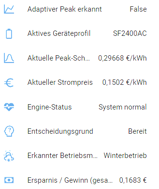
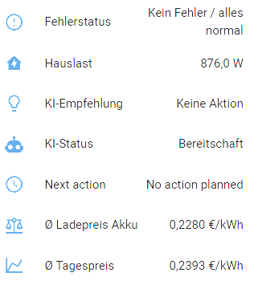
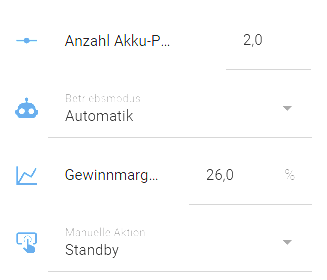
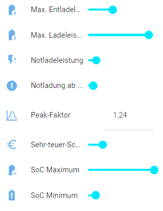

# Kapitel 1

# Was macht Battery SmartFlow AI?

**Battery SmartFlow AI** ist eine Home-Assistant-Integration zur intelligenten Steuerung von Zendure SolarFlow Batteriesystemen.

Sie verbindet Batterie, Photovoltaik, Hausverbrauch und – optional – dynamische Strompreise zu einem gemeinsamen Gesamtsystem.

Auf Basis dieser Informationen entscheidet die Integration automatisch:

- wann geladen wird  
- wann entladen wird  
- wie stark geladen oder entladen wird  
- wann Stillstand sinnvoller ist  

Das Ziel ist nicht maximale Aktivität, sondern ein ausgewogenes Zusammenspiel aus:

- Wirtschaftlichkeit  
- Netzstabilität  
- Autarkie  
- technischer Sicherheit  

Battery SmartFlow AI arbeitet vollständig transparent:  
Jede Entscheidung kann über Sensoren in Home Assistant nachvollzogen werden.

Die Integration greift nicht blind ein –  
sie bewertet kontinuierlich die aktuelle Situation und reagiert nur dann, wenn eine Verbesserung möglich ist.

> Das Ergebnis: geringere Stromkosten, saubere Netzbilanz und nachvollziehbares Systemverhalten.

# Kapitel 2 – Zwingende Voraussetzungen

Damit Battery SmartFlow AI korrekt und stabil arbeiten kann, müssen bestimmte Einstellungen zwingend beachtet werden.

Die Integration übernimmt die vollständige Steuerung des Zendure-Systems.  
Parallele oder widersprüchliche Steuerungen führen zu Instabilität.

---

## 1️⃣ Zendure Original-App

In der offiziellen Zendure-App müssen folgende Punkte geprüft werden:

- Ladeleistung auf Maximum setzen  
- Entladeleistung auf Maximum setzen  
- HEMS deaktivieren  
- Keine zeitgesteuerten Lade-/Entladepläne aktiv  
- Keine externe Leistungsbegrenzung aktiv  

### ⚠ Hardwareliste prüfen (sehr wichtig)

In der Zendure-App darf sich in der **Hardwareliste ausschließlich der Wechselrichter bzw. die Zendure-Hardware selbst** befinden.

Es dürfen **keine zusätzlichen Geräte** eingebunden sein, wie zum Beispiel:

- Shelly Pro 3EM  
- externe Smart Meter / Zähler  
- Zendure eigene Messsensoren  
- sonstige Leistungs- oder Netzsensoren  

Externe Messgeräte oder interne HEMS-Komponenten beeinflussen das Regelverhalten des Systems und führen zu unvorhersehbaren Eingriffen (z. B. blockierte AC-Modi, Leistungsbegrenzungen oder Richtungswechsel).

Battery SmartFlow AI benötigt eine „saubere“ Hardwarekonfiguration ohne parallele Steuerinstanzen.

---

## 2️⃣ Zendure Home-Assistant Integration

Folgende Einstellungen sind erforderlich:

- Energie-Export: **Erlaubt**  
- Kein P1-Sensor auswählen  
- Zendure Manager: **deaktiviert**  
- Keine parallelen Automationen, die AC-Modus oder Leistungsgrenzen verändern  

Falsche Einstellungen können führen zu:

- Entladeabbrüchen  
- blockierten AC-Modi  
- Wechsel zwischen INPUT/OUTPUT  
- falschen Zuständen / Fehlinterpretationen  

---

## 3️⃣ Strompreis-Integration (optional)

Für preisbasierte Planung ist eine kompatible Strompreis-Integration erforderlich.

Unterstützt werden unter anderem:

- Tibber  
- EPEX Spot Integrationen  
- Octopus (inkl. Forecast-Attribute)  

Ohne Preisdaten arbeitet die Integration weiterhin PV- und lastbasiert, jedoch ohne Preisoptimierung.

---

## Wichtig

Wenn das System nicht wie erwartet arbeitet, sollten zuerst diese Voraussetzungen überprüft werden.

In den meisten Fällen liegt die Ursache in widersprüchlichen Einstellungen außerhalb der Integration.

# Kapitel 3 – Installation

Battery SmartFlow AI wird über HACS (Home Assistant Community Store) installiert.

Es gibt zwei Möglichkeiten:

---

## 🚀 Schnellinstallation (empfohlen)

Über folgenden Button kann das Repository direkt in HACS geöffnet werden:

[](https://my.home-assistant.io/redirect/hacs_repository/?owner=PalmManiac&repository=battery-smartflow-ai&category=integration)

Nach dem Öffnen:

1. Repository hinzufügen  
2. Integration installieren  

---

## 🔧 Manuelle Installation über HACS

Falls der Direktlink nicht genutzt wird:

1. HACS öffnen  
2. ⋮ → **Benutzerdefinierte Repositories**  
3. Repository-URL einfügen:  
   `https://github.com/PalmManiac/battery-smartflow-ai`  
4. Typ: **Integration** auswählen  
5. Hinzufügen bestätigen  

Anschließend:

1. In HACS nach **Battery SmartFlow AI** suchen  
2. Installieren  

---

## 🔄 Neustart erforderlich

Nach der Installation muss Home Assistant neu gestartet werden.

Erst nach dem Neustart steht die Integration unter  
**Einstellungen → Geräte & Dienste → Integration hinzufügen**  
zur Verfügung.

# Kapitel 4 – Konfiguration der Integration

Nach der Installation wird die Integration über  
**Einstellungen → Geräte & Dienste → Integration hinzufügen**  
eingerichtet.

Dieses Kapitel erklärt alle Felder des Konfigurationsdialogs in der Reihenfolge der Benutzeroberfläche.

---

## 4.1 Geräteprofil & Basisdaten


### Geräteprofil

Hier wird das passende Profil für das verwendete Zendure-Modell gewählt.

Das Profil definiert:

- Dynamik der Leistungsregelung  
- Sicherheitsgrenzen  
- Regelparameter  
- Hardware-Limits  

Es muss immer das tatsächlich verwendete Modell ausgewählt werden.

---

### Batterie-SoC Sensor

Sensor mit dem aktuellen Ladezustand (State of Charge) in Prozent.

- Einheit: %
- Pflichtfeld
- Grundlage aller Entscheidungen

Ohne gültigen SoC ist keine Steuerung möglich.

---

### SoC-Limit Status (optional)

Optionaler Sensor aus der Zendure-Integration.

Er meldet aktive BMS-Grenzen wie:

- Ladesperre  
- Entladesperre  

Die Integration respektiert diese Hardware-Grenzen strikt.

---

### Kapazität pro Akku-Pack (kWh)

Angabe der nutzbaren Kapazität eines einzelnen Akku-Packs.

Dieser Wert ist entscheidend für:

- kWh-Delta-Berechnung  
- Ladezeitabschätzung  
- Profit-Berechnung  
- Planung vor Preisspitzen  

Bei mehreren installierten Akku-Packs wird dieser Wert mit der Pack-Anzahl multipliziert.

⚠ Eine falsche Kapazitätsangabe führt zu falschen wirtschaftlichen Ergebnissen.

---

### PV-Leistung Sensor (optional)

Sensor mit aktueller PV-Leistung in Watt.

Wird genutzt für:

- Überschusserkennung  
- dynamische Regelung  
- saisonale Bewertung  

#### Nutzung ohne PV-Anlage

Wenn keine PV-Anlage vorhanden ist, kann ein einfacher Template-Sensor verwendet werden, der dauerhaft **0 W** liefert.

```yaml
template:
  - sensor:
      - name: "Dummy PV Power"
        unit_of_measurement: "W"
        state: 0
```

---

## 4.2 Preis- & AC-Konfiguration


### Preisverlauf (z. B. Tibber / EPEX)

Sensor mit zukünftigen Preisdaten.

Er muss Preisslots als Attribut enthalten.

Wird benötigt für:

- Adaptive Peak-Erkennung  
- Ladefenster-Planung  
- wirtschaftliche Entladeentscheidungen  

---

### Aktueller Strompreis

Sensor mit aktuellem Preis in €/kWh.

Wird für wirtschaftliche Echtzeit-Entscheidungen verwendet.

---

### Zendure AC-Betriebsmodus

Select-Entität aus der Zendure Home-Assistant Integration.

Schaltet zwischen:

- INPUT (Laden)  
- OUTPUT (Entladen)  

Battery SmartFlow AI steuert diesen Modus automatisch.

⚠ Es dürfen keine parallelen Automationen existieren, die diesen Modus verändern.

---

### Zendure Ladeleistung

Number-Entität zur Einstellung der AC-Ladeleistung in Watt.

Die Integration setzt hier dynamisch die berechnete Ladeleistung.

---

### Zendure Entladeleistung

Number-Entität zur Einstellung der AC-Entladeleistung in Watt.

Auch hier erfolgt eine dynamische Regelung.

---

## 4.3 Netzmessung


Hier wird definiert, wie der Netzfluss gemessen wird.

### Kein Netzsensor

Keine netzgeführte Leistungsregelung.

---

### Ein Sensor (+ / −)

Ein kombinierter Sensor:

- Positiver Wert → Netzbezug  
- Negativer Wert → Einspeisung  

---

### Zwei Sensoren (Bezug & Einspeisung)

Getrennte Sensoren für:

- Netzbezug  
- Netzeinspeisung  

Diese Variante ist am präzisesten.

---

## 4.4 Netzsensoren (Split-Modus)


Falls „Zwei Sensoren“ gewählt wurde, müssen hier:

- Netzbezug  
- Netzeinspeisung  

korrekt zugeordnet werden.

Eine falsche Zuordnung führt zu:

- instabiler Regelung  
- falscher Leistungsanpassung  
- unnötigem Netzbezug  

---

## Wichtiger Hinweis zur Zendure-App

In der Zendure-App dürfen in der Hardwareliste ausschließlich:

- der Wechselrichter  
- die Zendure-Batterie  

eingetragen sein.

Es dürfen **keine externen Zähler oder Messgeräte** (z. B. Shelly Pro 3EM oder Zendure-eigene Messsensoren) dort eingebunden sein.

Die gesamte Regelung erfolgt ausschließlich über Home Assistant.

# Kapitel 5 – Betriebsmodi & Arbeitsweise

Battery SmartFlow AI arbeitet kontextbasiert.  
Die Integration bewertet kontinuierlich:

- Batterie-SoC  
- Netzbezug / Einspeisung  
- PV-Leistung  
- Aktueller Strompreis  
- Zukünftige Preisstruktur  

Aus diesen Daten entstehen dynamische Lade- und Entladeentscheidungen.

---

## 5.1 Betriebsmodi

Die Integration kennt vier Betriebsmodi.

---

### 🔹 Automatik (empfohlen)

Standardmodus für die meisten Anwender.

Aktiv:

- PV-Überschussladen  
- Netzgeführte Leistungsregelung  
- Preisbasierte Entladung  
- Adaptive Peak-Erkennung  
- Sehr-teuer-Priorität  

Ziel:

> Maximale Wirtschaftlichkeit bei stabiler Regelung.

---

### 🔹 Sommermodus

Optimiert für hohe PV-Erzeugung.

Eigenschaften:

- Fokus auf Autarkie  
- Preisplanung deaktiviert  
- Entladung primär bei Netzdefizit  
- Sehr-teuer-Erkennung weiterhin aktiv  

Ziel:

> Möglichst wenig Netzbezug.

---

### 🔹 Wintermodus

Optimiert für geringe PV-Erzeugung.

Eigenschaften:

- Preisplanung aktiv  
- Vorbereitung auf Preisspitzen  
- Wirtschaftliche Entladung im Vordergrund  

Ziel:

> Strom dann nutzen, wenn er teuer ist.

---

### 🔹 Manuell

Keine KI-Logik.

Mögliche Aktionen:

- Laden  
- Entladen  
- Standby  

Die Integration greift nicht automatisch ein.

---

## 5.2 Adaptive Peak-Erkennung

Die Integration analysiert kontinuierlich die Tagespreisstruktur.

Ein Preis gilt als Peak, wenn er oberhalb der dynamischen Schwelle liegt:

Peak-Schwelle =  
max( Durchschnittspreis × Peak-Faktor,  
     Durchschnittspreis + 0,03 € )

Der Peak-Faktor ist ein einstellbarer Multiplikator.

Beispiel:

- Tagesdurchschnitt: 0,30 €/kWh  
- Peak-Faktor: 1,35  

→ Schwelle = 0,405 €/kWh  

Preise darüber werden als Hochpreisphase erkannt.

---

## 5.3 Entscheidungsgrund (Sensor)

Der Sensor „Entscheidungsgrund“ zeigt transparent an, warum eine Aktion ausgeführt wird.

Typische Werte:

- adaptive_peak_discharge  
- price_discharge  
- surplus_charge  
- cover_deficit  
- emergency_charge  
- standby  

Damit wird jede Aktion nachvollziehbar.

---

## 5.4 Sehr-teuer-Priorität

Wird die konfigurierte „Sehr-teuer-Schwelle“ überschritten:

- Entladung hat höchste Priorität  
- PV-Logik wird ignoriert  
- Planung wird übersteuert  
- SoC-Minimum bleibt geschützt  

Dies verhindert unnötig hohen Netzbezug bei Extrempreisen.

---

## 5.5 Netzgeführte Leistungsregelung

Die Entladeleistung wird dynamisch angepasst an:

- aktuellen Netzbezug  
- definierte Ziel-Importleistung  
- Geräteprofil-Parameter  

Ziel:

> Netzbezug möglichst nahe 0 W  
> ohne instabile Überregelung

Je nach Geräteprofil erfolgt die Regelung:

- konservativ  
- dynamisch  
- aggressiv  

---

## 5.6 Wirtschaftlichkeitsberechnung

Die Integration speichert:

- Durchschnittlichen Einkaufspreis geladener Energie  
- Geladene kWh  
- Entladene kWh  
- Realisierten Gewinn  

Bei Entladung wird berechnet:

(aktueller Preis – Durchschnittsladepreis) × entladene kWh

So entsteht der Sensor „Gewinn / Ersparnis“.

---

## 5.7 Transparenz-Sensoren

Zur Analyse stehen zur Verfügung:

- Durchschnittlicher Tagespreis  
- Aktuelle Peak-Schwelle  
- Engine-Status  
- Entscheidungsgrund  
- Adaptive Peak aktiv  

Damit ist jede Entscheidung technisch nachvollziehbar.

# Kapitel 6 – Sensoren & Steuerelemente

Dieses Kapitel beschreibt alle von Battery SmartFlow AI bereitgestellten Sensoren und Steuerelemente.

Die Sensoren dienen der Transparenz und Analyse.  
Die Steuerelemente ermöglichen gezielte Anpassungen der Strategie.

---

# 6.1 Status- & Wirtschaftssensoren



---

## Systemstatus

Zeigt den allgemeinen Zustand der Integration.

Typische Werte:

- OK
- Sensorfehler
- Initialisierung

---

## KI-Status

Beschreibt den aktuellen Betriebszustand der Engine.

Beispiele:

- Bereitschaft
- Entladung aktiv
- Laden aktiv
- Sehr teuer
- Notladung

---

## KI-Empfehlung

Zeigt, welche Aktion aktuell empfohlen wird:

- Keine Aktion
- Laden
- Entladen
- Notladen

---

## Hauslast

Berechnete aktuelle Hauslast in Watt.

Dieser Wert ergibt sich aus:

Netzbezug + Eigenverbrauch

Er dient zur dynamischen Leistungsregelung.

---

## Ø Ladepreis Akku

Durchschnittlicher Einkaufspreis der aktuell gespeicherten Energie.

Wird genutzt für:

- Gewinnberechnung
- Wirtschaftliche Entladung

---

## Ø Tagespreis

Durchschnitt aller verfügbaren Preisdaten des Tages.

Basis für:

- Adaptive Peak-Erkennung
- Dynamische Peak-Schwelle

---

# 6.2 Peak- & Transparenzsensoren



---

## Adaptiver Peak erkannt

Boolean-Sensor.

True → Aktueller Preis liegt oberhalb der dynamischen Peak-Schwelle.  
False → Kein Hochpreisbereich.

---

## Aktuelle Peak-Schwelle

Preiswert in €/kWh.

Berechnung:

max( Durchschnittspreis × Peak-Faktor,  
     Durchschnittspreis + 0,03 € )

Dient als dynamische Hochpreis-Grenze.

---

## Aktueller Strompreis

Echtzeitpreis in €/kWh.

Wird für:

- Entladeentscheidung
- Gewinnberechnung
- Sehr-teuer-Erkennung

verwendet.

---

## Engine-Status

Diagnosesensor.

Typische Werte:

- System normal
- Keine Preisdaten
- Kein aktueller Preis
- Sensor ungültig

Erleichtert Fehlersuche.

---

## Entscheidungsgrund

Transparenz-Sensor.

Zeigt exakt an, warum eine Aktion erfolgt.

Typische Werte:

- adaptive_peak_discharge
- price_discharge
- surplus_charge
- cover_deficit
- emergency_charge
- standby

---

## Aktives Geräteprofil

Zeigt das aktuell verwendete Regelprofil (z. B. SF2400AC).

---

## Erkannter Betriebsmodus

Automatisch erkannter Modus:

- Winterbetrieb
- Sommerbetrieb
- Manuell

---

## Ersparnis / Gewinn

Berechneter realisierter Gewinn in Euro.

Berechnung:

(aktueller Preis − Durchschnittsladepreis) × entladene kWh

---

# 6.3 Steuerelemente



---

## Max. Entladeleistung

Begrenzt die maximale Entladeleistung in Watt.

Das Geräteprofil setzt zusätzlich Hardware-Grenzen.

---

## Max. Ladeleistung

Begrenzt die maximale AC-Ladeleistung.

---

## Notladeleistung

Leistung in Watt, die bei kritischem SoC genutzt wird.

---

## Notladung ab SoC

Schwellenwert, unter dem automatisch eine Notladung startet.

---

## Peak-Faktor

Multiplikator für die Adaptive Peak-Erkennung.

Niedriger Wert → mehr Peaks  
Höherer Wert → nur starke Preisspitzen

---

## Sehr-teuer-Schwelle

Ab diesem Preis wird Entladung priorisiert.

---

## SoC Maximum

Obergrenze für das Laden.

---

## SoC Minimum

Untergrenze für Entladung.

---



---

## Anzahl Akku-Packs

Multipliziert mit der Pack-Kapazität zur Gesamtberechnung.

Wichtig für:

- kWh-Berechnung
- Profit
- Planung

---

## Betriebsmodus

Auswahl zwischen:

- Automatik
- Sommer
- Winter
- Manuell

---

## Gewinnmarge (%)

Mindestgewinn, bevor wirtschaftliche Entladung erfolgt.

Verhindert unwirtschaftliche Mikro-Entladungen.

---

## Manuelle Aktion

Nur im manuellen Modus aktiv.

Optionen:

- Standby
- Laden
- Entladen

# Kapitel 7 – Technischer Hintergrund (für Power-User)

Dieses Kapitel beschreibt die interne Arbeitsweise von Battery SmartFlow AI.

Es richtet sich an technisch interessierte Anwender, die verstehen möchten, wie Entscheidungen entstehen und wie die Regelung im Detail funktioniert.

---

# 7.1 Architekturüberblick

Die Integration besteht aus drei Kernkomponenten:

1. Datenaggregation (Sensoraufnahme)
2. Decision Engine (Bewertung & Strategie)
3. Leistungsregler (dynamische Anpassung)

Der Ablauf pro Zyklus:

1. Sensorwerte werden gelesen
2. Kontext wird aufgebaut
3. Decision Engine bewertet die Situation
4. AC-Modus und Leistungswerte werden gesetzt
5. Status- und Transparenzsensoren werden aktualisiert

Der gesamte Prozess läuft zyklisch im definierten Update-Intervall.

---

# 7.2 Decision Engine

Die Decision Engine bewertet:

- SoC
- PV-Leistung
- Netzimport / Export
- Aktuellen Preis
- Preisprognose
- Saisonmodus
- Konfigurierte Schwellenwerte

Sie erzeugt:

- action (charge / discharge / idle / emergency)
- charge_w
- discharge_w
- reason (Entscheidungsgrund)
- target_soc (bei Planung)

Die Engine trifft nur strategische Entscheidungen.  
Die dynamische Leistungsregelung erfolgt anschließend.

---

# 7.3 Prioritätenhierarchie

Entscheidungen folgen einer festen Hierarchie:

1. Hardware-Schutz (SoC-Minimum / SoC-Limit)
2. Notladung
3. Sehr-teuer-Erkennung
4. Adaptive Peak-Erkennung
5. Preisplanung
6. PV-Überschuss
7. Defizitabdeckung
8. Standby

Höhere Prioritäten übersteuern niedrigere.

Dies verhindert widersprüchliche Aktionen.

---

# 7.4 Adaptive Peak-Logik

Die Adaptive Peak-Logik analysiert die Preisstruktur des Tages.

Schritt 1:
Berechnung des Tagesdurchschnitts.

Schritt 2:
Berechnung der dynamischen Schwelle:

max( Durchschnitt × Peak-Faktor,
     Durchschnitt + 0,03 € )

Schritt 3:
Vergleich mit aktuellem Preis.

Liegt der aktuelle Preis oberhalb dieser Schwelle,
wird eine Hochpreisphase erkannt.

Diese Logik reagiert dynamisch auf:

- volatile Märkte
- flache Preisprofile
- extreme Preisspitzen

---

# 7.5 Netzgeführter Delta-Regler

Nach der strategischen Entscheidung wird die Entladeleistung dynamisch angepasst.

Ziel:

Netzbezug möglichst nahe 0 W.

Der Regler berücksichtigt:

- Aktuellen Netzimport
- Ziel-Importwert (Geräteprofil)
- Deadband
- Regelverstärkung (KP_UP / KP_DOWN)
- Maximale Schrittweite

Das Ergebnis ist eine stabile Regelung ohne Überoszillation.

---

# 7.6 Geräteprofile

Geräteprofile definieren:

- Regelparameter
- Ziel-Importwert
- Deadband
- Maximale Leistungsänderungen
- Hardware-Grenzen

Beispiele:

- SF800Pro → konservativer
- SF2400AC → dynamischer
- SF1600AC+ → stärkerer Down-Regler

Profile ermöglichen modellabhängige Optimierung,
ohne dass der Nutzer selbst Reglerparameter ändern muss.

---

# 7.7 Wirtschaftlichkeitsberechnung

Die Integration speichert:

- Geladene kWh
- Durchschnittlichen Ladepreis
- Entladene kWh
- Realisierten Gewinn

Beim Entladen wird berechnet:

(aktueller Preis − Durchschnittsladepreis) × entladene kWh

Nur reale Entladung erzeugt Gewinn.

---

# 7.8 Hard-Sync mit der Hardware

Die Integration liest den realen AC-Modus der Zendure-Hardware.

Interner Zustand wird strikt vom Hardwarezustand abgeleitet:

- INPUT → charging
- OUTPUT → discharging
- 0 W → idle

Softwarezustand kann niemals Hardwarezustand überstimmen.

Dies verhindert Inkonsistenzen.

---

# 7.9 Planungssystem (Price Planning 2.0)

Die Planung analysiert:

- Zukünftige Preisspitzen
- Benötigte Energiemenge
- Verfügbare Zeitfenster
- Wirtschaftlichkeit

Ziel:

Vor einer Preisspitze ausreichend laden,
aber nur wenn es wirtschaftlich sinnvoll ist.

Das System vermeidet:

- unnötiges Volladen
- planungsbedingtes Hin-und-Her-Schalten
- Überplanung in der Vergangenheit

---

# 7.10 Stabilitätsmechanismen

Zur Vermeidung instabiler Zustände existieren:

- Anti-Flutter-Logik
- Mindestleistungsgrenzen
- Deadband-Regelung
- SoC-Schutz
- Hardware-Clamping

Das System priorisiert Stabilität vor maximaler Aggressivität.

# Kapitel 8 – FAQ & typische Probleme

Dieses Kapitel beschreibt häufige Fragen und typische Fehlerbilder.

---

## 8.1 Es wird kein adaptiver Peak erkannt

Mögliche Ursachen:

- Kein Preisverlauf-Sensor konfiguriert
- Preisattribute enthalten keine zukünftigen Slots
- Peak-Faktor zu hoch eingestellt
- Tagesdurchschnitt zu nah am aktuellen Preis

Prüfen:

- Sensor „Ø Tagespreis“
- Sensor „Aktuelle Peak-Schwelle“
- Sensor „Adaptiver Peak erkannt“

---

## 8.2 Engine-Status zeigt „Keine Preisdaten“

Ursache:

- Preisprognose-Sensor liefert keine gültigen Daten
- Attributstruktur wird nicht erkannt

Lösung:

- Entwicklerwerkzeuge → Zustände prüfen
- Sicherstellen, dass zukünftige Preisslots vorhanden sind

---

## 8.3 Gewinn bleibt 0 €

Gewinn wird nur berechnet, wenn:

- Energie zuvor geladen wurde
- Anschließend real entladen wird
- Ein aktueller Strompreis verfügbar ist

Keine Entladung → kein Gewinn.

---

## 8.4 Regelung wirkt instabil

Mögliche Ursachen:

- Falsch konfigurierte Netzsensoren
- Sensor vertauscht (Import / Export)
- Externe Automationen greifen ein
- Zendure-App enthält zusätzliche Geräte

Prüfen:

- Netzmodus korrekt gewählt?
- Split-Sensoren korrekt zugeordnet?
- Keine parallele Steuerung aktiv?

---

## 8.5 Netzbezug bleibt dauerhaft bei 30–100 W

Normaler Effekt bei:

- konservativem Geräteprofil
- Deadband-Regelung
- sehr kleinen Lastschwankungen

Feinjustierung erfolgt über das Geräteprofil.

---

## 8.6 Update von „Zendure SmartFlow AI“

Da sich die Domain geändert hat, ist eine Neuinstallation erforderlich.

Vorgehen:

1. In HACS das alte benutzerdefinierte Repository entfernen  
2. Home Assistant neu starten  
3. Neues Repository hinzufügen:  
   https://github.com/PalmManiac/battery-smartflow-ai  
4. Integration neu installieren  
5. Konfiguration neu durchführen  

Eine automatische Datenübernahme ist nicht möglich.

---

# Kapitel 9 – Best Practices & empfohlene Einstellungen

Dieses Kapitel beschreibt bewährte Einstellungen für verschiedene Szenarien.

---

## 9.1 Standard-Haushalt mit PV & dynamischem Tarif

Empfohlen:

- Modus: Automatik
- Peak-Faktor: 1.30 – 1.40
- Sehr-teuer-Schwelle leicht oberhalb Durchschnitt
- SoC-Minimum: 10–20 %

Ergebnis:

- wirtschaftliche Entladung
- stabile Regelung
- geringe Netzspitzen

---

## 9.2 Haushalt ohne PV (reine Preisstrategie)

Empfohlen:

- Dummy-PV-Sensor (0 W)
- Modus: Winter oder Automatik
- Peak-Faktor moderat (1.25–1.35)
- Gewinnmarge aktivieren

Ziel:

- günstig laden
- teuer entladen

---

## 9.3 Maximale Autarkie

Empfohlen:

- Sommermodus
- niedriger SoC-Minimum-Wert
- Peak-Faktor weniger relevant
- Netzsensor präzise konfigurieren

Ziel:

- Netzbezug minimieren

---

## 9.4 Volatile Strommärkte

Empfohlen:

- Peak-Faktor leicht reduzieren
- Gewinnmarge aktivieren
- Sehr-teuer-Schwelle nicht zu hoch setzen

Dadurch werden auch moderate Preisspitzen genutzt.

---

## 9.5 Stabilität vor Aggressivität

Wenn Regelung zu hektisch wirkt:

- Peak-Faktor erhöhen
- Gewinnmarge leicht erhöhen
- Keine unnötigen manuellen Eingriffe

---

## 9.6 Allgemeine Empfehlungen

- Keine parallelen Automationen für AC-Modus
- Keine externen Geräte in Zendure-App
- Preis- & Netzsensor regelmäßig prüfen
- Kapazität korrekt hinterlegen
- Geräteprofil passend wählen

---

Battery SmartFlow AI ist so konzipiert, dass es ohne manuelles Fein-Tuning stabil läuft.

Feinanpassungen sind möglich – aber nicht zwingend erforderlich.
