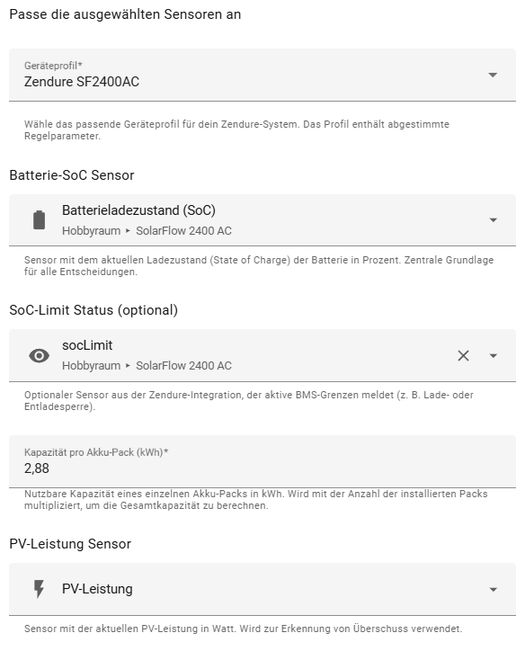
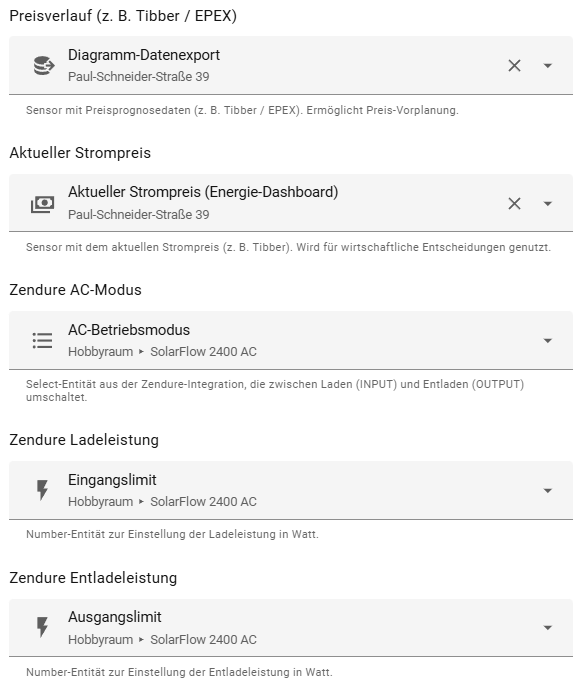
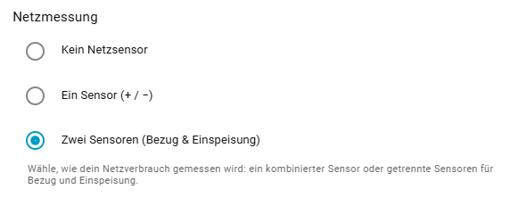
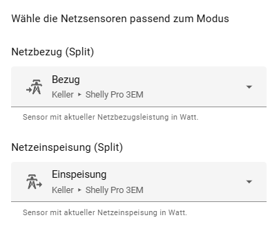

# Kapitel 1

# Was macht Battery SmartFlow AI?

**Battery SmartFlow AI** ist eine Home-Assistant-Integration zur intelligenten Steuerung von Zendure SolarFlow Batteriesystemen.

Sie verbindet Batterie, Photovoltaik, Hausverbrauch und – optional – dynamische Strompreise zu einem gemeinsamen Gesamtsystem.

Auf Basis dieser Informationen entscheidet die Integration automatisch:

- wann geladen wird  
- wann entladen wird  
- wie stark geladen oder entladen wird  
- wann Stillstand sinnvoller ist  

Das Ziel ist nicht maximale Aktivität, sondern ein ausgewogenes Zusammenspiel aus:

- Wirtschaftlichkeit  
- Netzstabilität  
- Autarkie  
- technischer Sicherheit  

Battery SmartFlow AI arbeitet vollständig transparent:  
Jede Entscheidung kann über Sensoren in Home Assistant nachvollzogen werden.

Die Integration greift nicht blind ein –  
sie bewertet kontinuierlich die aktuelle Situation und reagiert nur dann, wenn eine Verbesserung möglich ist.

> Das Ergebnis: geringere Stromkosten, saubere Netzbilanz und nachvollziehbares Systemverhalten.

# Kapitel 2 – Zwingende Voraussetzungen

Damit Battery SmartFlow AI korrekt und stabil arbeiten kann, müssen bestimmte Einstellungen zwingend beachtet werden.

Die Integration übernimmt die vollständige Steuerung des Zendure-Systems.  
Parallele oder widersprüchliche Steuerungen führen zu Instabilität.

---

## 1️⃣ Zendure Original-App

In der offiziellen Zendure-App müssen folgende Punkte geprüft werden:

- Ladeleistung auf Maximum setzen  
- Entladeleistung auf Maximum setzen  
- HEMS deaktivieren  
- Keine zeitgesteuerten Lade-/Entladepläne aktiv  
- Keine externe Leistungsbegrenzung aktiv  

### ⚠ Hardwareliste prüfen (sehr wichtig)

In der Zendure-App darf sich in der **Hardwareliste ausschließlich der Wechselrichter bzw. die Zendure-Hardware selbst** befinden.

Es dürfen **keine zusätzlichen Geräte** eingebunden sein, wie zum Beispiel:

- Shelly Pro 3EM  
- externe Smart Meter / Zähler  
- Zendure eigene Messsensoren  
- sonstige Leistungs- oder Netzsensoren  

Externe Messgeräte oder interne HEMS-Komponenten beeinflussen das Regelverhalten des Systems und führen zu unvorhersehbaren Eingriffen (z. B. blockierte AC-Modi, Leistungsbegrenzungen oder Richtungswechsel).

Battery SmartFlow AI benötigt eine „saubere“ Hardwarekonfiguration ohne parallele Steuerinstanzen.

---

## 2️⃣ Zendure Home-Assistant Integration

Folgende Einstellungen sind erforderlich:

- Energie-Export: **Erlaubt**  
- Kein P1-Sensor auswählen  
- Zendure Manager: **deaktiviert**  
- Keine parallelen Automationen, die AC-Modus oder Leistungsgrenzen verändern  

Falsche Einstellungen können führen zu:

- Entladeabbrüchen  
- blockierten AC-Modi  
- Wechsel zwischen INPUT/OUTPUT  
- falschen Zuständen / Fehlinterpretationen  

---

## 3️⃣ Strompreis-Integration (optional)

Für preisbasierte Planung ist eine kompatible Strompreis-Integration erforderlich.

Unterstützt werden unter anderem:

- Tibber  
- EPEX Spot Integrationen  
- Octopus (inkl. Forecast-Attribute)  

Ohne Preisdaten arbeitet die Integration weiterhin PV- und lastbasiert, jedoch ohne Preisoptimierung.

---

## Wichtig

Wenn das System nicht wie erwartet arbeitet, sollten zuerst diese Voraussetzungen überprüft werden.

In den meisten Fällen liegt die Ursache in widersprüchlichen Einstellungen außerhalb der Integration.

# Kapitel 3 – Installation

Battery SmartFlow AI wird über HACS (Home Assistant Community Store) installiert.

Es gibt zwei Möglichkeiten:

---

## 🚀 Schnellinstallation (empfohlen)

Über folgenden Button kann das Repository direkt in HACS geöffnet werden:

[](https://my.home-assistant.io/redirect/hacs_repository/?owner=PalmManiac&repository=battery-smartflow-ai&category=integration)

Nach dem Öffnen:

1. Repository hinzufügen  
2. Integration installieren  

---

## 🔧 Manuelle Installation über HACS

Falls der Direktlink nicht genutzt wird:

1. HACS öffnen  
2. ⋮ → **Benutzerdefinierte Repositories**  
3. Repository-URL einfügen:  
   `https://github.com/PalmManiac/battery-smartflow-ai`  
4. Typ: **Integration** auswählen  
5. Hinzufügen bestätigen  

Anschließend:

1. In HACS nach **Battery SmartFlow AI** suchen  
2. Installieren  

---

## 🔄 Neustart erforderlich

Nach der Installation muss Home Assistant neu gestartet werden.

Erst nach dem Neustart steht die Integration unter  
**Einstellungen → Geräte & Dienste → Integration hinzufügen**  
zur Verfügung.

# Kapitel 4 – Konfiguration der Integration

Nach der Installation wird die Integration über  
**Einstellungen → Geräte & Dienste → Integration hinzufügen**  
eingerichtet.

Dieses Kapitel erklärt alle Felder des Konfigurationsdialogs in der Reihenfolge der Benutzeroberfläche.

---

## 4.1 Geräteprofil & Basisdaten



### Geräteprofil

Hier wird das passende Profil für das verwendete Zendure-Modell gewählt.

Das Profil definiert:

- Dynamik der Leistungsregelung  
- Sicherheitsgrenzen  
- Regelparameter  
- Hardware-Limits  

Es muss immer das tatsächlich verwendete Modell ausgewählt werden.

---

### Batterie-SoC Sensor

Sensor mit dem aktuellen Ladezustand (State of Charge) in Prozent.

- Einheit: %
- Pflichtfeld
- Grundlage aller Entscheidungen

Ohne gültigen SoC ist keine Steuerung möglich.

---

### SoC-Limit Status (optional)

Optionaler Sensor aus der Zendure-Integration.

Er meldet aktive BMS-Grenzen wie:

- Ladesperre  
- Entladesperre  

Die Integration respektiert diese Hardware-Grenzen strikt.

---

### Kapazität pro Akku-Pack (kWh)

Angabe der nutzbaren Kapazität eines einzelnen Akku-Packs.

Dieser Wert ist entscheidend für:

- kWh-Delta-Berechnung  
- Ladezeitabschätzung  
- Profit-Berechnung  
- Planung vor Preisspitzen  

Bei mehreren installierten Akku-Packs wird dieser Wert mit der Pack-Anzahl multipliziert.

⚠ Eine falsche Kapazitätsangabe führt zu falschen wirtschaftlichen Ergebnissen.

---

### PV-Leistung Sensor (optional)

Sensor mit aktueller PV-Leistung in Watt.

Wird genutzt für:

- Überschusserkennung  
- dynamische Regelung  
- saisonale Bewertung  

#### Nutzung ohne PV-Anlage

Wenn keine PV-Anlage vorhanden ist, kann ein einfacher Template-Sensor verwendet werden, der dauerhaft **0 W** liefert.

```yaml
template:
  - sensor:
      - name: "Dummy PV Power"
        unit_of_measurement: "W"
        state: 0
```

---

## 4.2 Preis- & AC-Konfiguration



### Preisverlauf (z. B. Tibber / EPEX)

Sensor mit zukünftigen Preisdaten.

Er muss Preisslots als Attribut enthalten.

Wird benötigt für:

- Adaptive Peak-Erkennung  
- Ladefenster-Planung  
- wirtschaftliche Entladeentscheidungen  

---

### Aktueller Strompreis

Sensor mit aktuellem Preis in €/kWh.

Wird für wirtschaftliche Echtzeit-Entscheidungen verwendet.

---

### Zendure AC-Betriebsmodus

Select-Entität aus der Zendure Home-Assistant Integration.

Schaltet zwischen:

- INPUT (Laden)  
- OUTPUT (Entladen)  

Battery SmartFlow AI steuert diesen Modus automatisch.

⚠ Es dürfen keine parallelen Automationen existieren, die diesen Modus verändern.

---

### Zendure Ladeleistung

Number-Entität zur Einstellung der AC-Ladeleistung in Watt.

Die Integration setzt hier dynamisch die berechnete Ladeleistung.

---

### Zendure Entladeleistung

Number-Entität zur Einstellung der AC-Entladeleistung in Watt.

Auch hier erfolgt eine dynamische Regelung.

---

## 4.3 Netzmessung



Hier wird definiert, wie der Netzfluss gemessen wird.

### Kein Netzsensor

Keine netzgeführte Leistungsregelung.

---

### Ein Sensor (+ / −)

Ein kombinierter Sensor:

- Positiver Wert → Netzbezug  
- Negativer Wert → Einspeisung  

---

### Zwei Sensoren (Bezug & Einspeisung)

Getrennte Sensoren für:

- Netzbezug  
- Netzeinspeisung  

Diese Variante ist am präzisesten.

---

## 4.4 Netzsensoren (Split-Modus)



Falls „Zwei Sensoren“ gewählt wurde, müssen hier:

- Netzbezug  
- Netzeinspeisung  

korrekt zugeordnet werden.

Eine falsche Zuordnung führt zu:

- instabiler Regelung  
- falscher Leistungsanpassung  
- unnötigem Netzbezug  

---

## Wichtiger Hinweis zur Zendure-App

In der Zendure-App dürfen in der Hardwareliste ausschließlich:

- der Wechselrichter  
- die Zendure-Batterie  

eingetragen sein.

Es dürfen **keine externen Zähler oder Messgeräte** (z. B. Shelly Pro 3EM oder Zendure-eigene Messsensoren) dort eingebunden sein.

Die gesamte Regelung erfolgt ausschließlich über Home Assistant.
