# 📘 Battery SmartFlow AI – Anleitung

**Intelligente, wirtschaftliche und stabile Steuerung für Zendure SolarFlow Systeme in Home Assistant**

---

## Inhaltsverzeichnis

* [Kapitel 1 – Was macht Battery SmartFlow AI?](#kapitel-1--was-macht-battery-smartflow-ai)
* [Kapitel 2 – Zwingende Voraussetzungen](#kapitel-2--zwingende-voraussetzungen)
* [Kapitel 3 – Installation](#kapitel-3--installation)
* [Kapitel 4 – Konfiguration der Integration](#kapitel-4--konfiguration-der-integration)
* [Kapitel 5 – Betriebsmodi & Arbeitsweise](#kapitel-5--betriebsmodi--arbeitsweise)
* [Kapitel 6 – Sensoren & Steuerelemente](#kapitel-6--sensoren--steuerelemente)
* [Kapitel 7 – Regelprofil bearbeiten](#kapitel-7--regelprofil-bearbeiten)
* [Kapitel 8 – Technischer Hintergrund](#kapitel-8--technischer-hintergrund)
* [Kapitel 9 – FAQ & typische Probleme](#kapitel-9--faq--typische-probleme)
* [Kapitel 10 – Best Practices](#kapitel-10--best-practices--empfohlene-einstellungen)
* [Anhang 1 – Geräteprofil-Parameter](#anhang-1--geräteprofil-parameter)
* [Anhang 2 – Wichtige Diagnosewerte für Support](#anhang-2--wichtige-diagnosewerte-für-support)

---

# Kapitel 1 – Was macht Battery SmartFlow AI?

**Battery SmartFlow AI** ist eine Home-Assistant-Integration zur intelligenten Steuerung von Zendure SolarFlow Batteriesystemen.

Sie verbindet Batterie, Photovoltaik, Hausverbrauch und – optional – dynamische Strompreise, PV-Prognosen, zusätzliche Akkusysteme und Off-Grid-Verbraucher zu einem gemeinsamen Gesamtsystem.

Auf Basis dieser Informationen entscheidet die Integration automatisch:

* wann geladen wird
* wann entladen wird
* wie stark geladen oder entladen wird
* wann Stillstand sinnvoller ist
* wann Schutzfunktionen Vorrang haben
* wann technische Haltezustände sinnvoll sind
* wann eine Off-Grid-/Inselsteckdose aktiv unterstützt werden soll

---

## 🎯 Ziel der Integration

Battery SmartFlow AI versucht nicht einfach nur, möglichst oft zu laden oder zu entladen.

Das Ziel ist ein ausgewogenes Zusammenspiel aus:

| Ziel                  | Bedeutung                                      |
| --------------------- | ---------------------------------------------- |
| 💶 Wirtschaftlichkeit | günstige Preise nutzen, teure Preise vermeiden |
| ☀️ PV-Nutzung         | PV-Überschuss sinnvoll speichern               |
| 🏠 Hauslastdeckung    | Netzbezug reduzieren                           |
| 🔋 Batterieschutz     | SoC- und Zellschutz beachten                   |
| ⚙️ Regelstabilität    | unnötiges INPUT-/OUTPUT-Flattern vermeiden     |
| 🔍 Transparenz        | Entscheidungen nachvollziehbar machen          |

> [!TIP]
> Das beste Ergebnis ist nicht immer exakt `0 W` Netzbezug.
> Ein kleiner, stabiler Ziel-Netzbezug kann oft ruhiger und geräteschonender sein als eine aggressive 0-W-Regelung.

---

## 🧠 Grundprinzip

Battery SmartFlow AI trennt zwei Ebenen:

### 1. Strategische Entscheidung

Die strategische Ebene entscheidet:

> **Was soll grundsätzlich passieren?**

Beispiele:

* PV-Überschuss laden
* Hauslast decken
* günstiges Preisfenster zum Laden nutzen
* teures Preisfenster zum Entladen nutzen
* Notladung auslösen
* Off-Grid-Last unterstützen
* wegen Schutzbedingungen nichts tun

### 2. Technische Leistungsregelung

Die technische Ebene entscheidet:

> **Wie wird diese Entscheidung stabil am Gerät umgesetzt?**

Beispiele:

* Darf jetzt wirklich von INPUT nach OUTPUT gewechselt werden?
* Ist der Export stabil genug für PV-Ladung?
* Muss OUTPUT nach einem Lastabfall langsam heruntergeregelt werden?
* Soll ein Befehl erneut geschrieben werden oder kann er übersprungen werden?
* Wie stark darf die Leistung pro Regelzyklus steigen oder fallen?

Diese Trennung ist die wichtigste Grundlage der V4.2-Architektur.

---

## ✨ Was ist neu ab V4.x / V4.2?

Battery SmartFlow AI hat sich seit den frühen Versionen deutlich weiterentwickelt.

Wichtige Neuerungen:

* 🌦️ optionale PV-Prognoseintegration
* 🧠 lernbasierte Ladefenster-Planung
* 📊 zusätzliche Diagnosewerte
* ⚙️ Profil-Editor für Lade- und Entladeverhalten
* 🛡️ Zellspannungs-Schutz
* 🔋 Zusatzakku-Erkennung
* 🔌 Unterstützung für Off-Grid-/Inselsteckdose
* 🔁 neue V4.2-Leistungsregelung
* ☀️ stabilere PV-Überschussladung
* 🏠 stabilere Entladung bei schnellen Lastwechseln
* 🧩 mehr gerätespezifische Profile
* ⚡ verbesserte Regelung für kleinere Systeme wie 800-W-Klassen
* 🧘 deutlich weniger Modusflattern

---

## 🧭 Kurz gesagt

Battery SmartFlow AI soll nicht möglichst viel schalten, sondern:

> **Erst verstehen, dann entscheiden, dann technisch sauber regeln.**

---

# Kapitel 2 – Zwingende Voraussetzungen

Damit Battery SmartFlow AI korrekt und stabil arbeiten kann, müssen bestimmte Einstellungen zwingend beachtet werden.

Die Integration übernimmt die vollständige Steuerung des Zendure-Systems.
Parallele oder widersprüchliche Steuerungen führen zu Instabilität.

> [!IMPORTANT]
> Wenn das System nicht wie erwartet arbeitet, sollten zuerst die Voraussetzungen in diesem Kapitel geprüft werden.
> Viele Fehler entstehen durch parallele Regelungen außerhalb von Battery SmartFlow AI.

---

## 1️⃣ Zendure Original-App

In der offiziellen Zendure-App müssen folgende Punkte geprüft werden:

* Ladeleistung auf Maximum setzen
* Entladeleistung auf Maximum setzen
* HEMS deaktivieren
* keine zeitgesteuerten Lade-/Entladepläne aktivieren
* keine externe Leistungsbegrenzung aktivieren

---

### ⚠ Hardwareliste prüfen

In der Zendure-App sollte die Hardwarekonfiguration möglichst sauber sein.

Besonders kritisch sind zusätzliche Steuer- oder Messkomponenten, die selbst Einfluss auf das Regelverhalten nehmen können.

Problematisch können sein:

* Shelly Pro 3EM direkt in Zendure
* externe Smart Meter / Zähler
* Zendure eigene Messsensoren mit HEMS-Regelung
* sonstige Leistungs- oder Netzsensoren, die Zendure direkt steuern
* aktive App-Automationen

Battery SmartFlow AI benötigt eine möglichst saubere Hardwarekonfiguration ohne parallele Steuerinstanzen.

---

## 2️⃣ Zendure Home-Assistant Integration

Folgende Einstellungen sind erforderlich:

* Energie-Export: **Erlaubt**
* kein P1-Sensor in der Zendure-Integration auswählen
* Zendure Manager: **deaktiviert**
* keine parallelen Automationen, die AC-Modus oder Leistungsgrenzen verändern

Falsche Einstellungen können führen zu:

* Entladeabbrüchen
* blockierten AC-Modi
* Wechsel zwischen INPUT/OUTPUT
* falschen Zuständen
* Fehlinterpretationen
* stark erhöhter Schaltzahl

---

## 3️⃣ Strompreis-Integration

Eine Strompreis-Integration ist optional, aber für wirtschaftliche Preislogik erforderlich.

Unterstützt werden grundsätzlich alle Sensoren, die einen aktuellen Strompreis und optional Preisprognosedaten liefern.

Typische Quellen:

* Tibber
* EPEX
* Octopus Energy
* Octopus Energy Forecast API
* eigene Template-Sensoren

Ohne Strompreis bleibt weiterhin möglich:

* PV-Überschussladung
* Sommer-Hauslastdeckung
* manuelle Steuerung
* Schutzlogik
* Off-Grid-Erkennung
* Diagnose

Ohne Strompreis stehen preisbasierte Lade- und Entladeentscheidungen nicht oder nur eingeschränkt zur Verfügung.

---

## 4️⃣ PV-Prognose

PV-Prognosen sind optional.

Wenn passende Prognosesensoren vorhanden sind, kann Battery SmartFlow AI sie für bessere Ladeplanung nutzen.

Typische Sensoren:

* PV-Prognose heute
* PV-Prognose morgen

Die Prognose wird nicht als alleinige Wahrheit behandelt. Sie ist ein zusätzlicher Planungs-Input.

Battery SmartFlow AI berücksichtigt weiterhin:

* reale aktuelle PV-Leistung
* Netzbezug
* Netzeinspeisung
* Hauslast
* SoC
* Preisfenster
* gelernte Verbrauchsdaten

Wenn keine Prognose konfiguriert ist, funktioniert die Integration weiterhin.

---

## 🛡️ Wichtig

Battery SmartFlow AI ist kein Ersatz für die Schutzfunktionen des Herstellers.

Die Integration setzt Entscheidungen in Home Assistant um. Die eigentliche Hardware, das BMS und die Zendure-Firmware behalten ihre eigenen Schutzmechanismen.

Trotzdem sollten alle Grenzwerte sinnvoll gesetzt werden.

---

# Kapitel 3 – Installation

Battery SmartFlow AI wird über HACS installiert.

---

## 🚀 Schnellinstallation über HACS

Über folgenden Button kann das Repository direkt in HACS geöffnet werden:

[](https://my.home-assistant.io/redirect/hacs_repository/?owner=PalmManiac&repository=battery-smartflow-ai&category=integration)

Danach:

1. Repository hinzufügen
2. Integration installieren
3. Home Assistant neu starten
4. Integration über Geräte & Dienste hinzufügen

---

## 🔧 Manuelle Installation über HACS

Falls der Direktlink nicht genutzt wird:

1. HACS öffnen
2. ⋮ → **Benutzerdefinierte Repositories**
3. Repository-URL einfügen:

```text
https://github.com/PalmManiac/battery-smartflow-ai
```

4. Typ: **Integration** auswählen
5. Hinzufügen bestätigen
6. In HACS nach **Battery SmartFlow AI** suchen
7. Installieren

---

## 🔄 Neustart erforderlich

Nach der Installation muss Home Assistant neu gestartet werden.

Erst nach dem Neustart steht die Integration unter:

```text
Einstellungen → Geräte & Dienste → Integration hinzufügen
```

zur Verfügung.

---

## Hinweis zum alten Namen

Battery SmartFlow AI hieß früher **Zendure SmartFlow AI**.

Wenn eine sehr alte Version installiert war, kann es sein, dass in Home Assistant noch alte Namen oder alte Integrationseinträge sichtbar sind.

Wichtig ist:

* der neue Repository-Name lautet `battery-smartflow-ai`
* die Domain lautet `battery_smartflow_ai`
* alte manuelle Installationen sollten sauber entfernt werden
* nach Umbenennungen ist ein Neustart sinnvoll

Falls Home Assistant noch einen alten Anzeigenamen zeigt, obwohl die neue Integration korrekt geladen ist, kann das an alten gespeicherten Integrationseinträgen liegen.

---

# Kapitel 4 – Konfiguration der Integration

Nach der Installation wird Battery SmartFlow AI über Home Assistant eingerichtet:

```text
Einstellungen → Geräte & Dienste → Integration hinzufügen → Battery SmartFlow AI
```

Ein Beispiel für den Integrationseintrag:

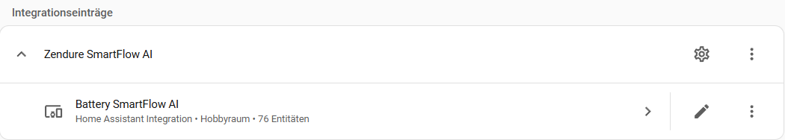

> [!NOTE]
> Dieser Screenshot zeigt den Integrationseintrag in Home Assistant.
> Die eigentliche Konfiguration erfolgt über den Einrichtungsdialog und den späteren Optionen-/Profilbereich.

---

## 4.1 Geräteprofil & Basisdaten

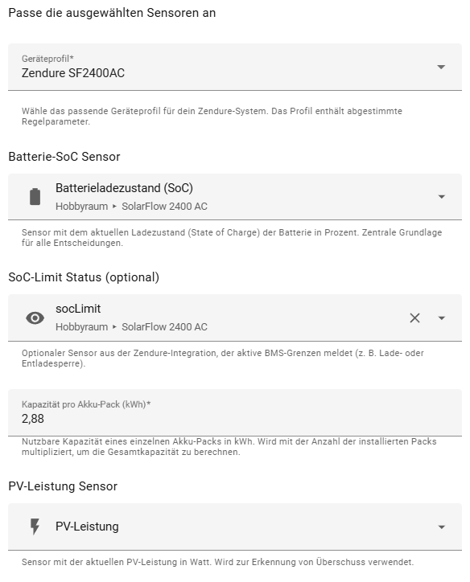

---

### Geräteprofil

Hier wird das passende Profil für das verwendete Zendure-Modell gewählt.

Das Profil definiert:

* Dynamik der Leistungsregelung
* Sicherheitsgrenzen
* Regelparameter
* Hardware-Limits
* Low-SoC-Verhalten
* Off-Grid-Fähigkeiten
* Mode-Switch-Verhalten

Aktuell unterstützte bzw. vorgesehene Profile:

| Profil              | Typischer Einsatz                       |
| ------------------- | --------------------------------------- |
| SolarFlow 800 Pro   | kleinere 800-W-Systeme                  |
| SolarFlow 800 Pro 2 | neues 800Pro2-System mit eigenem Tuning |
| SolarFlow 1600 AC   | 1600-W-Klasse                           |
| SolarFlow 2400 AC   | 2400-W-AC-System                        |
| SolarFlow 2400 AC+  | erweiterte 2400-W-AC-Variante           |
| SolarFlow 2400 Pro  | 2400-Pro-Systeme                        |
| Hyper 2000          | Hyper-Systeme                           |
| HUB 2000            | HUB-Systeme                             |

> [!IMPORTANT]
> Wähle immer das Profil, das deinem System am nächsten kommt.
> Ein falsches Profil kann zu zu aggressiver oder zu träger Regelung führen.

---

### Batterie-SoC Sensor

Sensor mit dem aktuellen Ladezustand der Batterie in Prozent.

* Einheit: %
* Pflichtfeld
* Grundlage aller Entscheidungen

Ohne gültigen SoC ist keine Steuerung möglich.

Der SoC wird genutzt für:

* SoC-Minimum
* SoC-Maximum
* Notladung
* Entladefreigabe
* Lernplanung
* Schutzentscheidungen
* verfügbare Batterieenergie

---

### SoC-Limit Status

Optionaler Sensor aus der Zendure-Integration.

Er meldet aktive BMS-Grenzen wie:

* Ladesperre
* Entladesperre

Battery SmartFlow AI respektiert diese Hardware-Grenzen.

Typische Zustände:

| Zustand             | Bedeutung                                |
| ------------------- | ---------------------------------------- |
| kein Limit aktiv    | Laden und Entladen grundsätzlich möglich |
| oberes Limit aktiv  | Laden wird blockiert                     |
| unteres Limit aktiv | Entladen wird blockiert                  |
| nicht konfiguriert  | Sensor wurde nicht ausgewählt            |

---

### Kapazität pro Akku-Pack

Angabe der nutzbaren Kapazität eines einzelnen Akku-Packs in kWh.

Dieser Wert ist entscheidend für:

* kWh-Delta-Berechnung
* Ladezeitabschätzung
* Profit-Berechnung
* Lernplanung
* Planung vor Preisspitzen
* verfügbare Batterieenergie

Bei mehreren installierten Akku-Packs wird dieser Wert mit der Pack-Anzahl multipliziert.

Beispiel:

```text
2 Akkupacks × 2,88 kWh = 5,76 kWh
```

> [!WARNING]
> Eine falsche Kapazitätsangabe führt zu falschen wirtschaftlichen Ergebnissen und ungenauer Ladeplanung.

---

### Batterie-Leistungssensor

Der Batterie-Leistungssensor ist wichtig für die Bilanzierung.

Empfohlenes Vorzeichen:

| Zustand          | Wert    |
| ---------------- | ------- |
| Batterie entlädt | positiv |
| Batterie lädt    | negativ |

Dieser Sensor wird genutzt für:

* Erkennung realer Ladung
* Erkennung realer Entladung
* Hauslastberechnung
* Lernplanung
* Ladepreisberechnung
* Profit-/Ersparnisberechnung

Wenn das Vorzeichen falsch ist, können Berechnungen und Diagnosen unplausibel werden.

---

### PV-Leistung Sensor

Sensor mit aktueller PV-Leistung in Watt.

Wird genutzt für:

* Überschusserkennung
* dynamische Regelung
* saisonale Bewertung
* Lernplanungskontext
* PV-Hauslastdeckung
* Off-Grid-Kontext
* Prognosevergleich

---

### Nutzung ohne PV-Anlage

Wenn keine PV-Anlage vorhanden ist, kann ein einfacher Template-Sensor verwendet werden, der dauerhaft **0 W** liefert.

```yaml
template:
  - sensor:
      - name: "Dummy PV Power"
        unit_of_measurement: "W"
        state: "0"
```

---

## 4.2 Preis & AC

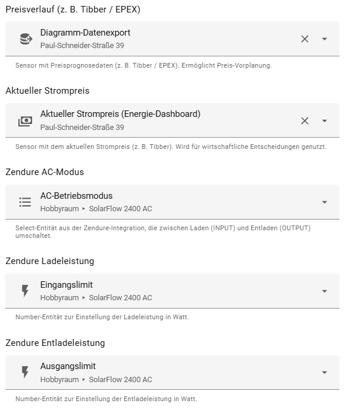

---

### Preisverlauf

Der Preisverlauf ist optional, aber für Planung und dynamische Preislogik sehr wichtig.

Er enthält künftige Preiswerte, z. B. für die nächsten Stunden oder den nächsten Tag.

Battery SmartFlow AI nutzt diese Daten für:

* Tal-Erkennung
* Peak-Erkennung
* geplante Ladung
* Lernplanung
* wirtschaftliche Entladung
* Preisfensterbewertung

---

### Aktueller Strompreis

Der aktuelle Strompreis wird für Entscheidungen im aktuellen Moment genutzt.

Beispiele:

* Ist der aktuelle Preis sehr günstig?
* Ist der aktuelle Preis hoch genug zum Entladen?
* Lohnt sich eine Entladung gegenüber dem gespeicherten Ladepreis?
* Ist eine Notladung oder geplante Ladung wirtschaftlich sinnvoll?

---

### Zendure AC-Betriebsmodus

Der AC-Modus ist die zentrale Umschaltung des Zendure-Systems.

Typischerweise gibt es:

* INPUT
* OUTPUT

INPUT bedeutet in der Regel:

* Batterie laden
* AC-Ladepfad aktiv

OUTPUT bedeutet in der Regel:

* Batterie entladen
* Hauslastdeckung
* technischer Versorgungspfad

Battery SmartFlow AI setzt diesen Modus automatisch.

---

### Zendure Ladeleistung

Die Ladeleistungs-Entität ist eine Number-Entität.

Battery SmartFlow AI setzt hier die gewünschte Ladeleistung in Watt.

---

### Zendure Entladeleistung

Die Entladeleistungs-Entität ist ebenfalls eine Number-Entität.

Battery SmartFlow AI setzt hier die gewünschte Entladeleistung in Watt.

---

## 4.3 Netzmessung

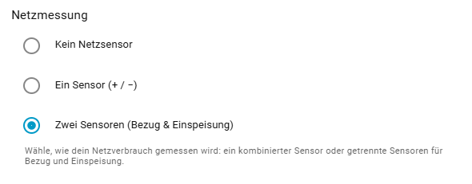

Die Netzmessung ist entscheidend für eine gute Regelung.

Battery SmartFlow AI unterstützt drei Varianten.

---

### Kein Netzsensor

In diesem Modus kann Battery SmartFlow AI nur eingeschränkt arbeiten.

Möglich sind dann vor allem:

* SoC-basierte Entscheidungen
* Preislogik
* Notladung
* manuelle Steuerung

Nicht optimal möglich sind:

* genaue Hauslastdeckung
* genaue PV-Überschusserkennung
* stabile 0-W-Regelung
* präzise V4.2-Leistungsregelung

---

### Ein Sensor (+ / −)

Ein kombinierter Netzsensor liefert:

| Wert    | Bedeutung   |
| ------- | ----------- |
| positiv | Netzbezug   |
| negativ | Einspeisung |

Beispiel:

```text
+250 W = Netzbezug
-400 W = Netzeinspeisung
```

Battery SmartFlow AI rechnet daraus intern Bezug und Einspeisung.

---

### Zwei Sensoren

Empfohlen ist der Split-Modus mit zwei getrennten Sensoren:

* Netzbezug
* Netzeinspeisung

Beide Sensoren liefern positive Werte.

Beispiel:

```text
Netzbezug: 250 W
Netzeinspeisung: 0 W
```

oder:

```text
Netzbezug: 0 W
Netzeinspeisung: 400 W
```

Diese Variante ist am eindeutigsten und für die Regelung besonders gut geeignet.

---

## 4.4 Netzsensoren im Split-Modus

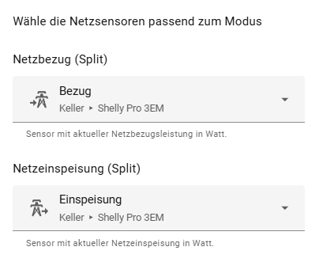

Im Split-Modus müssen zwei Sensoren ausgewählt werden:

* Netzbezug
* Netzeinspeisung

> [!WARNING]
> Achte darauf, dass die Sensoren nicht vertauscht werden.
> Vertauschte Sensoren führen zu falschen Entscheidungen.

Typische Folgen vertauschter Sensoren:

* Laden bei Netzbezug
* Entladen bei Einspeisung
* falsche Hauslast
* unplausible Diagnosewerte
* instabile Regelung

---

## 4.5 Zusatzakku-Erkennung

Battery SmartFlow AI kann optional ein weiteres Akkusystem beobachten.

Dafür gibt es zwei optionale Sensoren:

* Zusatzakku Ladeleistung
* Zusatzakku Entladeleistung

Diese Funktion ist wichtig, wenn mehrere Batteriesysteme im Haus vorhanden sind, die aber noch nicht koordiniert gemeinsam gesteuert werden.

---

### Zusatzakku lädt

Wenn ein anderer Akku gerade lädt, kann Battery SmartFlow AI die eigene Entladung blockieren.

Grund:

> Ein Akku soll nicht indirekt den anderen Akku laden.

Beispiel:

```text
Zusatzakku lädt mit 500 W
Battery SmartFlow AI würde eigentlich entladen
→ Entladung wird blockiert
```

---

### Zusatzakku entlädt

Wenn ein anderer Akku gerade entlädt, kann Battery SmartFlow AI das eigene Laden blockieren.

Grund:

> Die Entladung des anderen Akkus darf nicht fälschlich als PV-Überschuss interpretiert werden.

Beispiel:

```text
Zusatzakku entlädt mit 400 W
Netzsensor zeigt dadurch scheinbar weniger Bezug
Battery SmartFlow AI könnte sonst PV-Laden starten
→ Laden wird blockiert
```

---

### Ziel der Zusatzakku-Erkennung

Die Funktion verhindert:

* Akku-zu-Akku-Laden
* falsche PV-Überschusserkennung
* unnötige Lade-/Entladezyklen
* Konflikte zwischen getrennten Batteriesystemen

> [!NOTE]
> Eine echte koordinierte Multi-Battery-Steuerung ist damit noch nicht gemeint.
> Diese ist für eine spätere größere Version vorgesehen.

---

## 4.6 Off-Grid-/Inselsteckdose

Einige Zendure-Systeme besitzen eine Off-Grid- bzw. Inselsteckdose.

Battery SmartFlow AI kann diese optional auswerten.

Dazu gibt es zwei optionale Konfigurationsfelder:

* Off-Grid-Leistung / Inselsteckdose
* Off-Grid-Modus


---

### Off-Grid-Leistung

Der Off-Grid-Leistungssensor meldet die Leistung an der Inselsteckdose.

Für bestätigte 2400er-Zendure-Systeme gilt:

* positive Werte bedeuten aktive Last an der Inselsteckdose

Beispiel:

```text
Off-Grid-Leistung: 520 W
→ an der Inselsteckdose hängt eine Last von ca. 520 W
```

Battery SmartFlow AI kann diese Information nutzen, um zu verhindern, dass automatische AC-/Netzladung die Inselsteckdosen-Versorgung überstimmt.

---

### Off-Grid-Modus

Der Off-Grid-Modus ist ein optionaler Select-Sensor.

Typische interne Zustände:

| Zustand  | Bedeutung                   |
| -------- | --------------------------- |
| `off`    | Off-Grid aus                |
| `normal` | Normalbetrieb               |
| `eco`    | ökonomischer Off-Grid-Modus |

Battery SmartFlow AI liest diesen Modus nur.

> [!IMPORTANT]
> Battery SmartFlow AI setzt oder verändert den Off-Grid-Modus nicht.
> Die Steuerung bleibt bei Zendure App, ZHA oder der verwendeten Zendure-Integration.

---

### Verhalten bei aktiver Off-Grid-Last

Wenn eine Off-Grid-Last aktiv ist, kann Battery SmartFlow AI automatische AC-Ladung blockieren.

Grund:

> Zendure soll die Inselsteckdose möglichst aus PV/Akku versorgen und nicht gleichzeitig über AC Leistung ziehen oder den Akku zusätzlich laden.

Battery SmartFlow AI kann dazu den technischen Zustand verwenden:

```text
offgrid_load_support
```

Das bedeutet:

* Off-Grid-Last erkannt
* automatische Netzladung wird blockiert
* OUTPUT wird als technischer Versorgungspfad genutzt
* SoC- und Zellschutz bleiben aktiv
* manuelle oder echte Notladung bleibt erlaubt

---

### Was darf Off-Grid überstimmen?

Bei aktiver Off-Grid-Last werden automatische Ladegründe blockiert, zum Beispiel:

* Preisladung
* Tal-Ladung
* Lernplanung
* geplante Netzladung
* sehr-billig-Ladung

Weiterhin erlaubt bleiben:

* Notladung
* Zellspannungs-Notladung
* manuelles Laden

---

### Einschränkung

Die Off-Grid-Logik ist bewusst konservativ.

Wenn eine Off-Grid-Last aktiv ist, wird automatische AC-Ladung blockiert – auch bei sehr kleiner Last.

Das verhindert unerwünschtes AC-Ziehen, kann aber bei sehr kleinen Dauerlasten bedeuten, dass automatische AC-Ladung nicht startet.

Eine feinere Option kann in einer späteren Version ergänzt werden.

---

## Wichtiger Hinweis zur Zendure-App

Damit Battery SmartFlow AI zuverlässig arbeiten kann, sollten in der Zendure-App keine parallelen Automationen aktiv sein.

Besonders kritisch sind:

* automatische HEMS-Regelung
* eigene Lade-/Entladepläne
* dynamische Leistungsregelung außerhalb von BSFAI
* P1-Regelung innerhalb der Zendure-Integration
* parallele Home-Assistant-Automationen auf denselben Entitäten

---

# Kapitel 5 – Betriebsmodi & Arbeitsweise

Battery SmartFlow AI bietet mehrere Betriebsmodi.

Die Modi bestimmen, welche strategischen Entscheidungen bevorzugt werden.

---

## 5.1 Betriebsmodi

---

## 🔹 Automatik

Der Automatikmodus ist der empfohlene Standardmodus.

Er kombiniert:

* PV-Leistung
* Hauslast
* SoC
* dynamische Preise
* PV-Prognose
* Lernplanung
* Saisonerkennung
* Schutzlogik

Battery SmartFlow AI entscheidet automatisch, ob gerade eher Sommer- oder Winterlogik sinnvoll ist.

Typische Entscheidungen:

* PV-Überschuss laden
* bei hoher Last entladen
* bei günstigen Preisen laden
* bei hohen Preisen entladen
* bei schwacher PV-Prognose rechtzeitig nachladen
* bei ausreichender Batterie nichts tun
* Schutzbedingungen respektieren

---

## 🔹 Sommermodus

Der Sommermodus ist auf Autarkie und Hauslastdeckung ausgelegt.

Typische Ziele:

* vorhandene PV optimal nutzen
* Hauslast decken
* unnötigen Netzbezug reduzieren
* PV-Überschuss laden
* Akku nicht unnötig aus dem Netz laden

Im Sommermodus ist Entladung zur Hauslastdeckung besonders wichtig.

Wenn SoC-Minimum oder Entlade-Wiederfreigabe aktiv ist, kann Entladung blockiert werden. In solchen Fällen hat die Schutzlogik Vorrang.

---

## 🔹 Wintermodus

Der Wintermodus ist stärker wirtschaftlich geprägt.

Typische Ziele:

* günstige Preisfenster zum Laden nutzen
* teure Preisfenster zum Entladen nutzen
* schwache PV-Prognose berücksichtigen
* geplante Ladefenster verwenden
* Akku nicht sinnlos entladen, wenn kein wirtschaftlicher Vorteil besteht

Der Wintermodus ist besonders sinnvoll bei dynamischen Strompreisen.

---

## 🔹 Manuell

Im manuellen Modus greift Battery SmartFlow AI nicht strategisch ein.

Der Nutzer kann wählen:

* Standby
* Laden
* Entladen
* konstante Entladung

Der manuelle Modus ist nützlich für:

* Tests
* Diagnose
* Sonderfälle
* manuelle Eingriffe
* Vergleich mit automatischer Regelung

Schutzmechanismen können dennoch weiterhin relevant bleiben.

---

## 5.2 Adaptive Peak-Erkennung

Die adaptive Peak-Erkennung erkennt teure Preisfenster.

Dabei wird nicht nur ein fixer Preis betrachtet, sondern das Preisniveau des Tages.

Der Peak-Faktor bestimmt, ab wann ein Preis als Peak gilt.

Formel:

```text
Peak-Schwelle = max(
  Durchschnittspreis × Peak-Faktor,
  Durchschnittspreis + 0,03 €
)
```

Standardwert:

```text
1.35
```

| Peak-Faktor | Wirkung                         |
| ----------- | ------------------------------- |
| niedriger   | erkennt mehr Peaks              |
| höher       | erkennt nur starke Preisspitzen |

---

## 5.3 Entscheidungsgrund

Der Sensor **Entscheidungsgrund** erklärt, warum Battery SmartFlow AI gerade eine Entscheidung getroffen hat.

Beispiele:

```text
pv_surplus_charge
summer_cover_deficit
price_based_discharge
adaptive_peak_discharge
planning_forecast_poor
learned_charge_window_wait
offgrid_load_support
soc_min_resume_block
cell_voltage_cutoff_block
```

> [!TIP]
> Wenn das System nicht das tut, was erwartet wird, sollte zuerst der Entscheidungsgrund geprüft werden.

---

## 5.4 Sehr-teuer- und Sehr-billig-Schwellen

Battery SmartFlow AI kann mit benutzerdefinierten Preisgrenzen arbeiten.

### Sehr-teuer-Schwelle

Diese Schwelle kann genutzt werden, um besonders teure Preisfenster zu markieren.

Sie kann Entladeentscheidungen beeinflussen.

### Sehr-billig-Schwelle

Diese Schwelle kann genutzt werden, um sehr günstige oder sogar negative Strompreise zu erkennen.

Bei sehr billigen Preisen kann eine Maximalladung sinnvoll sein.

Die Schwelle kann auch negative Werte annehmen, wenn der Tarif negative Preise liefert.

---

## 5.5 Netzgeführte Leistungsregelung

Battery SmartFlow AI versucht nicht einfach nur, mit voller Leistung zu laden oder zu entladen.

Stattdessen wird die Leistung an der Netzsituation ausgerichtet.

Beispiele:

* bei Netzbezug kann Entladung erhöht werden
* bei Einspeisung kann Ladeleistung erhöht werden
* bei Lastabfall wird OUTPUT nicht sofort hart beendet
* bei Wolken wird INPUT nicht sofort hektisch gewechselt
* kleine Abweichungen innerhalb einer Totzone werden ignoriert

Diese Regelung verhindert unnötiges Flattern.

---

## 5.6 V4.2-Regelkreis

Mit V4.2 wurde eine neue technische Regelkette eingeführt:

```text
Decision Engine
→ StrategyIntent
→ ModeArbiter
→ PowerController
→ DeviceCommand
→ Home Assistant / Zendure
```

### Decision Engine

Entscheidet strategisch, was passieren soll.

Beispiele:

* Laden
* Entladen
* Warten
* Notladen
* Off-Grid unterstützen

### StrategyIntent

Übersetzt die strategische Entscheidung in eine technische Absicht.

Beispiele:

```text
pv_charge
planned_charge
cover_deficit
peak_discharge
arbitrage_discharge
emergency_charge
manual_charge
offgrid_load_support
```

### ModeArbiter

Entscheidet, ob der gewünschte Modus jetzt technisch erlaubt ist.

Er berücksichtigt:

* aktuelle Netz-Historie
* stabile Importzyklen
* stabile Exportzyklen
* Moduswechsel-Cooldowns
* aktive Haltezustände
* Off-Grid-Lasten
* Zusatzakku-Entladung
* SoC-/Zellschutz

### PowerController

Berechnet die konkrete Leistung.

Er berücksichtigt:

* Ziel-Netzbezug
* Totzone
* Regelverstärkung
* maximale Schrittweite
* vorherige Leistung
* Profilgrenzen

### DeviceCommand

Erzeugt den endgültigen Befehl.

Er entscheidet:

* AC-Modus
* Input-Limit
* Output-Limit
* ob ein Wert geschrieben werden muss
* ob ein Schreibvorgang übersprungen werden kann

---

## 5.7 Wirtschaftlichkeitsberechnung

Battery SmartFlow AI kann berechnen, ob eine Entladung wirtschaftlich sinnvoll ist.

Dazu wird ein gewichteter durchschnittlicher Ladepreis ermittelt.

Beispiel:

```text
Akku wurde günstig mit 0,18 €/kWh geladen
aktueller Preis liegt bei 0,32 €/kWh
→ Entladung kann wirtschaftlich sinnvoll sein
```

Die Gewinnmarge bestimmt, wie groß der Preisabstand mindestens sein sollte.

---

### Wichtig bei PV-Ladung

PV-Ladung wird nicht als teurer Netzbezug gewertet.

Wenn der Akku aus PV geladen wird, soll dadurch nicht künstlich ein hoher Ladepreis entstehen.

---

### Technische Unterstützungsmodi

Einige Zustände sind technisch sinnvoll, aber keine wirtschaftliche Entladung.

Beispiele:

* Off-Grid-Unterstützung
* PV-Hauslast-Passthrough

Diese werden nicht als wirtschaftliche Preisentladung gezählt.

---

## 5.8 Transparenz-Sensoren

Battery SmartFlow AI stellt viele Sensoren bereit, um Entscheidungen nachvollziehbar zu machen.

Besonders hilfreich sind:

* Entscheidungsgrund
* KI-Status
* KI-Empfehlung
* Engine-Status
* effektive Entladeschwelle
* ökonomische Entladeschwelle
* Lernplanungsstatus
* Off-Grid-Regelgrund
* Regelgrund des ModeArbiters
* final gesetzte Leistung

---

# Kapitel 6 – Sensoren & Steuerelemente

Dieses Kapitel erklärt die wichtigsten Sensoren und Bedienelemente.

---

# 6.1 Status- & Wirtschaftssensoren

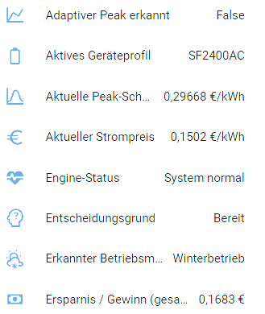

---

## Systemstatus

Zeigt den allgemeinen Zustand der Integration.

Typische Werte:

| Zustand              | Bedeutung                                      |
| -------------------- | ---------------------------------------------- |
| OK                   | Integration arbeitet normal                    |
| Initialisierung      | System startet                                 |
| Sensordaten ungültig | ein Pflichtsensor liefert keinen gültigen Wert |
| Preisdaten ungültig  | Preisquelle unbrauchbar                        |

---

## KI-Status

Zeigt den aktuellen Hauptzustand.

Beispiele:

* Bereitschaft
* Laden
* Entladen
* Notladung
* Manueller Modus

---

## KI-Empfehlung

Zeigt die aktuelle Empfehlung der Integration.

Beispiele:

* Laden
* Entladen
* Keine Aktion
* Notladung

---

## Hauslast

Die Hauslast wird aus Netz, PV und Batterie berechnet.

Sie ist die geschätzte reale Last des Haushalts.

Eine korrekte Hauslast ist wichtig für:

* Sommermodus
* Entladung
* Lernplanung
* Diagnose
* Profilanalyse

---

## Ø Ladepreis Akku

Der durchschnittliche Ladepreis ist ein gewichteter Wert.

Er beschreibt, zu welchem Preis die aktuell gespeicherte Energie ungefähr geladen wurde.

Er wird genutzt für:

* wirtschaftliche Entladung
* Profitberechnung
* Preisvergleich

---

## Ø Tagespreis

Der durchschnittliche Tagespreis wird aus den verfügbaren Preisprognosedaten berechnet.

Er dient als Grundlage für:

* Peak-Erkennung
* Tal-Erkennung
* relative Preisbewertung

---

# 6.2 Peak- & Transparenzsensoren

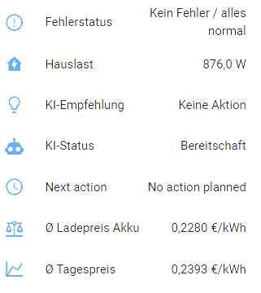

---

## Adaptiver Peak erkannt

Zeigt an, ob aktuell ein dynamisch erkannter Preispeak aktiv ist.

---

## Aktuelle Peak-Schwelle

Zeigt den Preiswert, ab dem der aktuelle Zeitraum als Peak gilt.

---

## Aktuelle Tal-Schwelle

Zeigt den Preiswert, unterhalb dessen ein Preisfenster als günstig gilt.

---

## Aktueller Strompreis

Zeigt den aktuell gültigen Strompreis.

---

## Engine-Status

Zeigt, ob die Entscheidungslogik vollständig arbeiten kann.

Beispiele:

* System normal
* Keine Preisdaten verfügbar
* Kein aktueller Strompreis
* Ungültige Sensordaten

---

## Entscheidungsgrund

Der wichtigste Erklärungssensor.

Er zeigt den genauen Grund für die aktuelle Entscheidung.

Beispiele:

* PV-Überschuss laden
* Sommer: Hauslast decken
* Preisbasierte Entladung
* Zusatzakku lädt: Entladung blockiert
* Inselsteckdose aktiv: Versorgung über Akku/PV
* Zellspannungs-Schutz aktiv

---

## Aktives Geräteprofil

Zeigt das verwendete Geräteprofil.

Dieser Wert ist bei Support-Anfragen sehr wichtig.

---

## Erkannter Betriebsmodus

Zeigt, ob Battery SmartFlow AI intern Sommer-, Winter- oder manuellen Betrieb erkennt.

---

## Ersparnis / Gewinn

Zeigt die berechnete Ersparnis bzw. den berechneten Gewinn durch Preisarbitrage.

---

# 6.3 Lernplanungssensoren

Die Lernplanung erzeugt mehrere Diagnosewerte.

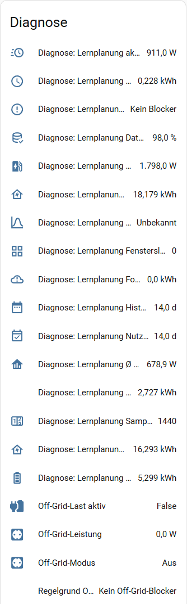

---

## Ladeplanung: Lernstatus

Zeigt, ob genügend Lerndaten vorhanden sind.

Typische Werte:

| Zustand                  | Bedeutung                                   |
| ------------------------ | ------------------------------------------- |
| Noch nicht gestartet     | es wurden noch keine Daten gesammelt        |
| Daten werden gesammelt   | Lernmodell baut Historie auf                |
| Nicht genügend Lerndaten | Bedingungen noch nicht erfüllt              |
| Bereit                   | Lernplanung kann verwendet werden           |
| Aktiv                    | Lernplanung steuert aktuell ein Ladefenster |

---

## Ladeplanung: Modus

Zeigt den aktuellen Modus der Lernplanung.

Beispiele:

* Deaktiviert
* Daten werden gesammelt
* Klassische Planung
* Lernplanung bereit
* Lernplanung wartet auf Ladefenster
* Lernplanung aktiv

---

## Ladeplanung: Geplanter Ladestart

Zeigt den optimal berechneten Startzeitpunkt für die geplante Ladung.

---

## Ladeplanung: Deadline

Zeigt den Zeitpunkt, bis zu dem die Batterie ausreichend geladen sein sollte.

---

## Ladeplanung: Nachladeenergie

Zeigt, wie viel Energie voraussichtlich nachgeladen werden muss.

---

## Ladeplanung: Fenstergröße

Zeigt die Länge des geplanten Ladefensters.

---

## Diagnose: Lernplanung Blockierungsgrund

Erklärt, warum Lernplanung noch nicht aktiv ist oder warum gerade keine Ladung geplant wird.

Beispiele:

* Kein Blocker
* Nicht genügend Historientage
* Datenqualität zu niedrig
* Keine Preisdaten verfügbar
* Keine Nachladung erforderlich
* Deadline zu nah

---

## Datenabdeckung

Zeigt, wie gut das gelernte Lastprofil bereits mit Daten gefüllt ist.

Eine hohe Datenabdeckung verbessert die Planung.

---

## Nutzbare Tage

Zeigt, wie viele Tage für das Lernmodell verwendet werden können.

---

## Erwarteter Verbrauch

Zeigt den erwarteten Verbrauch bis zur Planungsdeadline.

---

## Verfügbare Akkuenergie

Zeigt, wie viel Energie oberhalb des SoC-Minimums verfügbar ist.

Die Berechnung basiert auf:

```text
Gesamtkapazität × max(0, (aktueller SoC - SoC-Minimum) / 100)
```

---

## Reserve

Zeigt die eingeplante Sicherheitsreserve.

---

## Prognose-Zuschlag

Zeigt, wie die PV-Prognose die Ladeplanung beeinflusst.

---

# 6.4 Off-Grid-Sensoren

---

## Off-Grid-Leistung

Zeigt die gemessene Leistung an der Off-Grid-/Inselsteckdose.

Positive Werte werden als Last interpretiert.

---

## Off-Grid-Modus

Zeigt den gelesenen Off-Grid-Modus.

Mögliche normalisierte Werte:

* nicht konfiguriert
* unbekannt
* aus
* normal
* ökonomisch

---

## Off-Grid-Last aktiv

Zeigt, ob eine relevante Last an der Inselsteckdose erkannt wurde.

---

## Off-Grid-Quelle aktiv

Diagnosewert für mögliche Off-Grid-Eingangsleistung.

Dieser Bereich ist aktuell vorsichtig zu interpretieren, da nicht alle Geräte die Richtung gleich melden.

---

## Regelgrund Off-Grid

Zeigt, was die Off-Grid-Logik aktuell macht.

Mögliche Gründe:

```text
none
offgrid_load_active_blocks_ac_charge
offgrid_load_support
```

| Regelgrund                             | Bedeutung                                             |
| -------------------------------------- | ----------------------------------------------------- |
| `none`                                 | Kein Off-Grid-Blocker aktiv                           |
| `offgrid_load_active_blocks_ac_charge` | Off-Grid-Last aktiv, automatische AC-Ladung blockiert |
| `offgrid_load_support`                 | Inselsteckdose wird aktiv über Akku/PV unterstützt    |

---

# 6.5 Zellspannungs-Sensoren

Der Zellspannungs-Schutz ist optional und gehört zum Expertenbereich.

Er kann verwendet werden, wenn passende Sensoren für die niedrigste Zellspannung je Akkupack vorhanden sind.

---

## Globale niedrigste Zellspannung

Zeigt die niedrigste Zellspannung über alle konfigurierten Packs.

---

## Zellspannungs-Status

Mögliche Zustände:

* Deaktiviert
* Normal
* Warnbereich aktiv
* Entladesperre aktiv
* Sensordaten ungültig

---

## Zellspannungs-Notladung aktiv

Zeigt, ob wegen kritischer Zellspannung eine Notladung aktiv ist.

---

## Entladung durch Zellspannungs-Schutz blockiert

Zeigt, ob die Entladung wegen Zellspannung blockiert ist.

---

## Plausibilität SoC / Zellspannung

Dieser Diagnosewert hilft zu erkennen, ob SoC und Zellspannung zusammen plausibel wirken.

Beispiele:

* plausibel
* auffällig
* kritisch unplausibel
* nicht verfügbar

---

# 6.6 Steuerelemente

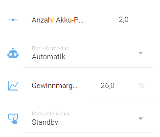

---

## Max. Entladeleistung

Begrenzt die maximale Entladeleistung.

Dieser Wert wird zusätzlich durch das Geräteprofil begrenzt.

---

## Max. Ladeleistung

Begrenzt die maximale Ladeleistung.

Dieser Wert wird zusätzlich durch das Geräteprofil begrenzt.

---

## Notladeleistung

Leistung, mit der bei Notladung geladen wird.

---

## Notladung ab SoC

SoC-Schwelle, ab der eine Notladung ausgelöst werden kann.

---

## Peak-Faktor

Bestimmt, wie empfindlich adaptive Preispeaks erkannt werden.

---

## Sehr-teuer-Schwelle

Benutzerdefinierte Schwelle für sehr teure Preise.

---

## Sehr-billig-Schwelle

Benutzerdefinierte Schwelle für sehr günstige Preise.

Kann auch negativ sein, wenn der Tarif negative Preise liefert.

---

## SoC Maximum

Oberes Ladeziel.

---

## SoC Minimum

Untere Schutzgrenze.

---

## Anzahl Akku-Packs

Wird zusammen mit der Packkapazität für die Gesamtkapazität verwendet.

---

## Modus & Wirtschaft

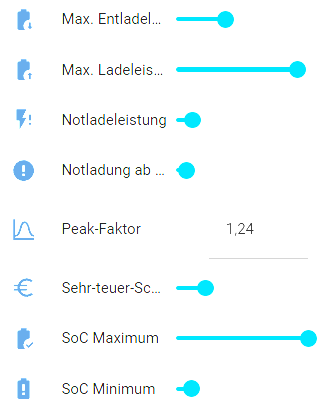

---

## Betriebsmodus

Auswahl zwischen:

* Automatik
* Sommer
* Winter
* Manuell

---

## Gewinnmarge

Bestimmt, wie groß der Preisabstand zwischen Ladepreis und Entladepreis mindestens sein soll.

---

## Manuelle Aktion

Im manuellen Modus kann gewählt werden:

* Standby
* Laden
* Entladen
* konstante Entladung

---

# Kapitel 7 – Regelprofil bearbeiten

Battery SmartFlow AI besitzt einen Profil-Editor.

Damit können wichtige Regelparameter direkt über Home Assistant angepasst werden.

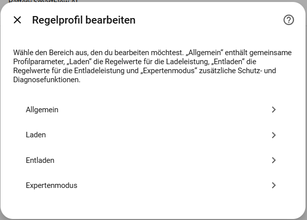

---

## 7.1 Bereiche im Profil-Editor

Der Profil-Editor ist in Bereiche aufgeteilt:

| Bereich       | Zweck                                  |
| ------------- | -------------------------------------- |
| Allgemein     | gemeinsame Profilwerte                 |
| Laden         | Regelwerte für INPUT/Ladeleistung      |
| Entladen      | Regelwerte für OUTPUT/Entladeleistung  |
| Expertenmodus | Lernplanung, V4.2-Regelung, Zellschutz |

---

## 7.2 Allgemein

Im Bereich **Allgemein** befinden sich gemeinsame Profilparameter.

Typische Werte:

* installierte PV-Leistung
* Ziel-Netzbezug
* Export-Schutz
* Keepalive Mindestdefizit
* Keepalive Mindestleistung
* Entlade-Wiederfreigabe oberhalb SoC-Minimum

---

### Ziel-Netzbezug

Ein kleiner gewollter Netzbezug kann die Regelung beruhigen.

Beispiel:

```text
Ziel-Netzbezug: 10 W
```

Das bedeutet:

Battery SmartFlow AI versucht nicht exakt 0 W zu treffen, sondern lässt einen kleinen Bezug zu.

Das verhindert unnötige Einspeisung und reduziert Regelzacken.

---

### Export-Schutz

Der Export-Schutz ist eine zusätzliche Sicherheitsreserve gegen ungewollte Einspeisung.

Ein höherer Wert macht die Regelung vorsichtiger.

---

### Keepalive Mindestleistung

Dieser Wert hält eine Entladung ab einer Mindestleistung aktiv.

Zu niedrige Werte können zu Ein-/Aus-Flattern führen.

Zu hohe Werte können unnötigen Bezug oder Export verursachen.

---

## 7.3 Laden

Im Bereich **Laden** befinden sich die Regelparameter für INPUT/PV-Ladung.

Wichtige Werte:

* Laden Deadband
* Laden KP Hochregeln
* Laden KP Runterregeln
* Laden Max. Schritt Hochregeln
* Laden Max. Schritt Runterregeln

---

### Laden Deadband

Die Deadband ist ein Toleranzbereich.

Innerhalb dieses Bereichs wird nicht nachgeregelt.

| Einstellung         | Wirkung                                 |
| ------------------- | --------------------------------------- |
| höhere Deadband     | ruhiger, weniger kleine Korrekturen     |
| niedrigere Deadband | genauer, schneller, potenziell nervöser |

---

### Laden KP

KP bestimmt, wie stark auf Abweichungen reagiert wird.

| Einstellung    | Wirkung                                      |
| -------------- | -------------------------------------------- |
| höherer KP     | schnellere Reaktion, mehr Risiko für Sprünge |
| niedrigerer KP | ruhigere Reaktion, langsamere Anpassung      |

---

### Laden Max. Schritt

Begrenzt, wie stark die Ladeleistung pro Regelzyklus geändert werden darf.

Kleinere Schritte machen die Regelung ruhiger.

---

## 7.4 Entladen

Im Bereich **Entladen** befinden sich die Regelparameter für OUTPUT.

Wichtige Werte:

* Entladen Deadband
* Entladen KP Hochregeln
* Entladen KP Runterregeln
* Entladen Max. Schritt Hochregeln
* Entladen Max. Schritt Runterregeln

---

### Entladen Deadband

Toleranzbereich für die Entladung.

Ein höherer Wert kann bei nervösen Systemen helfen.

---

### Entladen KP

Bestimmt, wie stark die Entladeleistung angepasst wird.

Wenn die Entladekurve stark zackt, können niedrigere KP-Werte helfen.

---

### Entladen Max. Schritt

Begrenzt die Änderung pro Regelzyklus.

Für empfindliche Systeme sind kleinere Schritte oft besser.

---

## 7.5 Expertenmodus

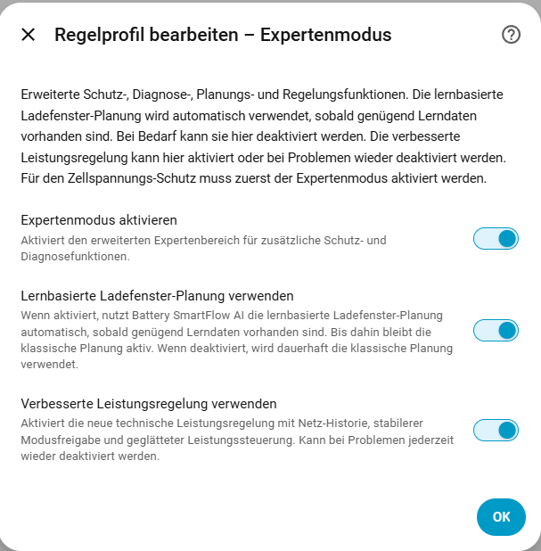

Im Expertenmodus können erweiterte Funktionen aktiviert werden:

* Expertenmodus selbst
* lernbasierte Ladefenster-Planung
* verbesserte V4.2-Leistungsregelung
* Zellspannungs-Schutz

---

### Expertenmodus aktivieren

Aktiviert den erweiterten Bereich für zusätzliche Schutz- und Diagnosefunktionen.

---

### Lernbasierte Ladefenster-Planung verwenden

Wenn aktiviert, nutzt Battery SmartFlow AI die Lernplanung automatisch, sobald genug Daten vorhanden sind.

Bis dahin bleibt klassische Planung aktiv.

---

### Verbesserte Leistungsregelung verwenden

Aktiviert den neuen V4.2-Regelkreis.

Diese Funktion kann bei Problemen jederzeit wieder deaktiviert werden.

Empfohlen für:

* stabilere PV-Ladung
* weniger INPUT-/OUTPUT-Flattern
* bessere Reaktion auf Lastwechsel
* stabilere SF800Pro-/SF800Pro2-ähnliche Systeme
* Off-Grid-Unterstützung

---

### Zellspannungs-Schutz aktivieren

Aktiviert die Möglichkeit, Zellspannungssensoren zu konfigurieren.

Der Schutz kann Entladung sperren oder Notladung auslösen.

---

# Kapitel 8 – Technischer Hintergrund

Dieses Kapitel richtet sich an Power-User.

---

# 8.1 Architekturüberblick

Battery SmartFlow AI arbeitet mit mehreren Ebenen.

```text
Sensoren
→ Kontext
→ Decision Engine
→ StrategyIntent
→ ModeArbiter
→ PowerController
→ DeviceCommand
→ Home Assistant Service Calls
```

---

## Kontext

Der Kontext enthält alle aktuellen Eingangsdaten:

* SoC
* PV-Leistung
* Hauslast
* Netzbezug
* Einspeisung
* Preis
* Preisprognose
* PV-Prognose
* Lernplanung
* Zellspannung
* Zusatzakku
* Off-Grid
* Geräteprofil

---

## Decision Engine

Die Decision Engine entscheidet strategisch.

Sie fragt:

* Muss geladen werden?
* Darf entladen werden?
* Gibt es PV-Überschuss?
* Ist der Preis günstig?
* Ist der Preis teuer?
* Gibt es eine Notladung?
* Ist eine Schutzfunktion aktiv?
* Gibt es eine aktive Off-Grid-Last?

---

## StrategyIntent

Der StrategyIntent beschreibt die technische Absicht.

Beispiele:

```text
pv_charge
planned_charge
cover_deficit
peak_discharge
arbitrage_discharge
manual_charge
emergency_charge
passthrough
```

---

## ModeArbiter

Der ModeArbiter entscheidet, ob der Moduswechsel technisch erlaubt ist.

Er verhindert unter anderem:

* zu frühes INPUT bei instabilem Export
* OUTPUT während SoC-/Zellschutz
* INPUT während Zusatzakku-Entladung
* AC-Ladung bei aktiver Off-Grid-Last
* schnelles Hin und Her nach Lastwechseln

---

## PowerController

Der PowerController berechnet die konkrete Leistung.

Er nutzt:

* Netz-Historie
* Ziel-Netzbezug
* Deadband
* KP-Werte
* Schrittbegrenzung
* Profilgrenzen
* vorherige Leistung

---

## DeviceCommand

DeviceCommand erzeugt den endgültigen Befehl.

Er entscheidet:

* AC-Modus
* Input-Limit
* Output-Limit
* ob ein Wert geschrieben werden muss
* ob ein Schreibvorgang übersprungen werden kann

---

# 8.2 Prioritätenhierarchie

Battery SmartFlow AI arbeitet mit Prioritäten.

| Priorität | Beispiele                                                      |
| --------- | -------------------------------------------------------------- |
| sehr hoch | Notladung, Zellspannungs-Notladung                             |
| hoch      | manuelles Laden/Entladen, harte Schutzsperren                  |
| mittel    | geplante Ladung, Lernplanung, Preisladung                      |
| mittel    | Peak-Entladung, Hauslastdeckung                                |
| technisch | Off-Grid-Unterstützung, PV-Hauslast-Passthrough, Haltezustände |

> [!IMPORTANT]
> Schutzfunktionen dürfen nicht von technischen Haltezuständen überstimmt werden.

---

# 8.3 Planungssystem

Battery SmartFlow AI kann Ladefenster planen.

Es berücksichtigt:

* zukünftige Preise
* aktuellen SoC
* SoC-Ziel
* PV-Prognose
* erwarteten Verbrauch
* Lernprofil
* Ladeleistung
* Deadline

Ziel ist nicht immer sofortiges Laden, sondern ein sinnvoller Zeitpunkt.

---

# 8.4 Lernplanung

Die Lernplanung nutzt 15-Minuten-Zeitslots.

Sie sammelt historische Hauslastdaten und erstellt daraus ein typisches Verbrauchsprofil.

Aktivierung erst bei ausreichender Datenbasis.

Typische Bereitschaftskriterien:

* genügend Historientage
* genügend nutzbare Tage
* ausreichende Kernzeit-Abdeckung
* hohe Datenabdeckung

Bis dahin bleibt klassische Planung aktiv.

---

# 8.5 Stabilitätsmechanismen

Wichtige Stabilitätsmechanismen:

* PV-Lade-Latch
* Entlade-Latch
* Passthrough-Latch
* Mode-Switch-Cooldowns
* stabile Importzyklen
* stabile Exportzyklen
* Post-Load-Drop-Hold
* Post-Output-Overshoot-Hold
* Schrittbegrenzung
* Deadband
* Schreibvermeidung bei unveränderten Befehlen

---

# 8.6 Geräteprofile

Geräteprofile enthalten nicht nur Leistungsgrenzen, sondern auch technische Fähigkeiten.

Beispiele:

* maximale INPUT-Leistung
* maximale OUTPUT-Leistung
* Reaktionsgeschwindigkeit
* Schrittweiten
* Cooldowns
* Off-Grid-Unterstützung
* INPUT-Keepalive-Sicherheit
* Fast-Mode-Switch-Fähigkeit
* Low-SoC-Verhalten
* Zellschutzverhalten
* Passthrough-Fähigkeit

---

# 8.7 SF800Pro / SF800Pro2 Hinweise

Kleinere Systeme der 800-W-Klasse können empfindlicher auf schnelle Regeländerungen reagieren.

Daher können eigene Profile sinnvoll sein.

Typische Optimierungen:

* kleinerer Max-Schritt
* höhere Deadband
* etwas Ziel-Netzbezug statt 0 W
* längere Haltezeiten
* langsamere INPUT-/OUTPUT-Wechsel
* konservativeres Low-SoC-Verhalten

> [!TIP]
> Ziel ist nicht immer perfekte 0 W, sondern stabile Regelung.

---

# 8.8 SF2400Pro / Low-SoC PV-Hauslast

Ein gemeldeter Sonderfall betrifft SF2400Pro-Systeme bei niedrigem SoC und schwacher PV.

Dabei kann es vorkommen, dass Battery SmartFlow AI wegen SoC-Minimum und Entlade-Wiederfreigabe auf Bereitschaft bleibt, obwohl manuell gesetztes OUTPUT ungefähr in Höhe der PV-Leistung eine Art PV-Hauslast-Bypass ermöglicht.

Dieser Fall ist verwandt mit früheren PV-Hauslast-Passthrough-Themen, aber nicht identisch mit Off-Grid.

Wenn er mit aktueller V4.2 weiterhin reproduzierbar ist, kann daraus eine spätere V4.2.1-Funktion entstehen.

Wichtig:

> Es soll nicht einfach Entladung trotz SoC-Schutz erlaubt werden.
> Ein sauberer Fix müsste PV-Leistung zur Hauslast führen, ohne normale Akkuentladung freizugeben.

---

# Kapitel 9 – FAQ & typische Probleme

---

## 9.1 Es wird kein adaptiver Peak erkannt

Mögliche Ursachen:

* keine Preisprognose vorhanden
* aktueller Preis fehlt
* Peak-Faktor zu hoch
* Tagespreise sind sehr gleichmäßig
* Preis liegt nicht weit genug über dem Tagesdurchschnitt

Prüfe:

* Engine-Status
* aktueller Strompreis
* Ø Tagespreis
* aktuelle Peak-Schwelle
* Preisverlauf

---

## 9.2 Engine-Status zeigt „Keine Preisdaten“

Dann fehlen Preisprognosedaten.

Mögliche Ursachen:

* Preisverlauf-Sensor nicht konfiguriert
* Sensor liefert keine Attribute
* Forecast-Format wird nicht erkannt
* Integration des Stromanbieters liefert gerade keine Daten

Ohne Preisprognose funktionieren PV- und Lastlogik weiterhin, aber Preisplanung ist eingeschränkt.

---

## 9.3 Gewinn bleibt 0 €

Mögliche Ursachen:

* keine reale Entladung erkannt
* kein gültiger Ladepreis gespeichert
* Akku wurde überwiegend aus PV geladen
* Preisunterschied zu klein
* technische Entladung wird nicht als Preisentladung gezählt
* Batterie-Leistungssensor hat falsches Vorzeichen

Prüfe:

* Ø Ladepreis Akku
* aktueller Strompreis
* Entscheidungsgrund
* Batterie-Leistung
* delta_kwh
* charge_source

---

## 9.4 Regelung wirkt instabil

Mögliche Ursachen:

* Netzsensor liefert sprunghafte Werte
* falsches Geräteprofil
* zu aggressive Profilwerte
* parallele Automationen
* Zendure-App regelt mit
* P1-Regelung in Zendure-Integration aktiv
* Deadband zu klein
* Max-Schritte zu groß

Maßnahmen:

* verbesserten V4.2-Regelkreis aktivieren
* korrektes Geräteprofil wählen
* Deadband erhöhen
* Schrittweiten reduzieren
* Ziel-Netzbezug leicht erhöhen
* parallele Automationen deaktivieren
* Netzsensor prüfen

---

## 9.5 Netzbezug bleibt dauerhaft bei 30–100 W

Das kann normal sein.

Battery SmartFlow AI arbeitet oft mit einem kleinen Ziel-Netzbezug.

Warum?

* weniger ungewollte Einspeisung
* stabilere Regelung
* weniger hektische Leistungssprünge
* weniger Schaltvorgänge

Ein perfekter 0-Wert ist nicht immer das stabilste Ziel.

---

## 9.6 PV-Ladung startet nicht

Mögliche Ursachen:

* keine stabile Einspeisung
* PV-Ladestart-Schwelle nicht erreicht
* Zusatzakku entlädt
* SoC-Maximum erreicht
* SoC-Limit aktiv
* Zellschutz aktiv
* ModeArbiter wartet auf stabile Exportzyklen
* post-output-hold aktiv

Prüfe:

* PV-Leistung
* Netzeinspeisung
* PV-Ladestart ab Einspeisung
* Entscheidungsgrund
* regulation_mode_arbiter_reason
* pv_charge_latched
* additional_battery_discharge_active

---

## 9.7 Entladung startet nicht

Mögliche Ursachen:

* SoC-Minimum erreicht
* Entlade-Wiederfreigabe noch nicht erreicht
* Zellspannung blockiert
* unteres SoC-Limit aktiv
* Preis nicht hoch genug
* Sommer/Winter-Logik entscheidet anders
* ModeArbiter wartet auf stabile Importzyklen
* Zusatzakku lädt

Prüfe:

* SoC
* SoC-Minimum
* discharge_resume_soc
* discharge_blocked_by_soc_min
* cell_voltage_discharge_blocked
* soc_limit_status
* Entscheidungsgrund
* effective_discharge_threshold
* regulation_mode_arbiter_reason

---

## 9.8 Off-Grid funktioniert nicht wie erwartet

Prüfe:

* Off-Grid-Leistung konfiguriert?
* Off-Grid-Modus konfiguriert?
* Off-Grid-Modus nicht `off`?
* Off-Grid-Leistung positiv?
* Off-Grid-Last aktiv?
* Off-Grid-Regelgrund?
* Entscheidung `offgrid_load_support`?
* set_input_w = 0?
* set_output_w > 0?

> [!NOTE]
> Battery SmartFlow AI kann nur das regeln, was Zendure-Firmware und Gerätegrenzen erlauben.
> Oberhalb der geräte- oder länderspezifischen Off-Grid-Grenzen kann Zendure eigenes Verhalten zeigen.

---

## 9.9 AC-Ladung startet nicht bei aktiver Off-Grid-Last

Das ist in V4.2 bewusst konservativ.

Wenn eine Off-Grid-Last aktiv ist, blockiert Battery SmartFlow AI automatische AC-Ladung, damit die Inselsteckdose nicht unerwünscht aus AC versorgt wird.

Erlaubt bleiben:

* Notladung
* Zellspannungs-Notladung
* manuelles Laden

Eine feinere Option für kleine Dauerlasten kann später ergänzt werden.

---

## 9.10 Update von „Zendure SmartFlow AI“

Wenn du von einer alten Version mit altem Namen kommst:

* alte Integration prüfen
* ggf. alte Custom Component entfernen
* neue Integration installieren
* Home Assistant neu starten
* Konfiguration prüfen
* Geräteprofil neu wählen
* optionale neue Sensoren ergänzen

---

# Kapitel 10 – Best Practices & empfohlene Einstellungen

---

## 10.1 Standard-Haushalt mit PV & dynamischem Tarif

Empfohlen:

* Automatikmodus
* korrekter Netzsensor
* Preisverlauf
* aktueller Strompreis
* PV-Prognose optional
* Lernplanung aktiviert
* verbesserte V4.2-Leistungsregelung aktiviert
* passendes Geräteprofil

---

## 10.2 Haushalt ohne PV

Empfohlen:

* Wintermodus oder Automatik
* Preisverlauf
* aktueller Preis
* Netzsensor
* SoC-Minimum sinnvoll setzen
* Gewinnmarge nicht zu niedrig
* sehr-billig-Schwelle konfigurieren, wenn Tarif negative Preise liefert

---

## 10.3 Maximale Autarkie

Empfohlen:

* Sommermodus oder Automatik
* PV-Leistungssensor
* Netzsensor
* PV-Ladestart-Schwelle passend setzen
* SoC-Minimum nicht zu hoch
* SoC-Maximum passend setzen
* V4.2-Regelung aktivieren

---

## 10.4 Volatile Strommärkte

Empfohlen:

* Automatik oder Wintermodus
* Preisverlauf vollständig prüfen
* Peak-Faktor passend wählen
* Gewinnmarge nicht zu niedrig setzen
* sehr-billig-Schwelle nutzen
* Lernplanung aktivieren
* Diagnosewerte beobachten

---

## 10.5 Stabilität vor Aggressivität

Eine stabile Regelung ist oft besser als ein perfekt ausgeregelter 0-W-Punkt.

Bei nervösem Verhalten:

* Deadband erhöhen
* Max-Schritte reduzieren
* Ziel-Netzbezug leicht erhöhen
* Cooldowns verlängern
* passendes Geräteprofil wählen
* V4.2-Regelung aktivieren

---

## 10.6 Kleine 800-W-Systeme

Bei kleineren Systemen wie SF800Pro oder SF800Pro2 können konservativere Werte sinnvoll sein.

Empfohlen:

* etwas Ziel-Netzbezug zulassen
* kleinere Schrittweiten
* höhere Deadband
* längere Haltezeiten
* keine aggressive 0-W-Jagd

---

## 10.7 Off-Grid-Nutzung

Empfohlen:

* Off-Grid-Leistung konfigurieren
* Off-Grid-Modus konfigurieren
* V4.2-Regelung aktivieren
* Diagnosewerte prüfen
* Verhalten mit und ohne AC testen
* gerätespezifische Grenzen beachten

---

# Anhang 1 – Geräteprofil-Parameter

Die folgenden Parameter sind typische Profilwerte.

Nicht jedes Profil verwendet alle Werte gleich.

---

## Allgemeine Werte

| Parameter                     | Bedeutung                                            |
| ----------------------------- | ---------------------------------------------------- |
| `TARGET_IMPORT_W`             | Zielwert für kleinen gewollten Netzbezug             |
| `DEADBAND_W`                  | allgemeine Totzone                                   |
| `EXPORT_GUARD_W`              | Schutzreserve gegen Einspeisung                      |
| `KEEPALIVE_MIN_DEFICIT_W`     | Mindestdefizit, ab dem Entladung aktiv gehalten wird |
| `KEEPALIVE_MIN_OUTPUT_W`      | Mindestleistung für stabile Entladung                |
| `SOC_DISCHARGE_RESUME_MARGIN` | SoC-Abstand oberhalb SoC-Minimum für Entladefreigabe |

---

## Lade-Regelung

| Parameter              | Bedeutung                                    |
| ---------------------- | -------------------------------------------- |
| `CHARGE_DEADBAND_W`    | Totzone für Ladeleistung                     |
| `CHARGE_KP_UP`         | Verstärkung beim Erhöhen der Ladeleistung    |
| `CHARGE_KP_DOWN`       | Verstärkung beim Reduzieren der Ladeleistung |
| `CHARGE_MAX_STEP_UP`   | maximaler Schritt beim Erhöhen               |
| `CHARGE_MAX_STEP_DOWN` | maximaler Schritt beim Reduzieren            |

---

## Entlade-Regelung

| Parameter                   | Bedeutung                                       |
| --------------------------- | ----------------------------------------------- |
| `DISCHARGE_TARGET_IMPORT_W` | Ziel-Netzbezug speziell für Entladung           |
| `DISCHARGE_DEADBAND_W`      | Totzone für Entladung                           |
| `DISCHARGE_KP_UP`           | Verstärkung beim Erhöhen der Entladeleistung    |
| `DISCHARGE_KP_DOWN`         | Verstärkung beim Reduzieren der Entladeleistung |
| `DISCHARGE_MAX_STEP_UP`     | maximaler Schritt beim Erhöhen der Entladung    |
| `DISCHARGE_MAX_STEP_DOWN`   | maximaler Schritt beim Reduzieren der Entladung |

---

## V4.2-Regelparameter

| Parameter                            | Bedeutung                                   |
| ------------------------------------ | ------------------------------------------- |
| `MODE_SWITCH_COOLDOWN_S`             | allgemeine Wartezeit zwischen Moduswechseln |
| `INPUT_AFTER_OUTPUT_BLOCK_S`         | Sperrzeit für INPUT nach OUTPUT             |
| `OUTPUT_AFTER_INPUT_BLOCK_S`         | Sperrzeit für OUTPUT nach INPUT             |
| `STABLE_EXPORT_CYCLES_FOR_PV_CHARGE` | stabile Exportzyklen für PV-Ladestart       |
| `STABLE_IMPORT_CYCLES_FOR_DISCHARGE` | stabile Importzyklen für Entladestart       |
| `PV_CHARGE_LATCH_MIN_HOLD_S`         | Mindesthaltezeit für aktive PV-Ladung       |
| `DISCHARGE_LATCH_MIN_HOLD_S`         | Mindesthaltezeit für aktive Entladung       |
| `PASSTHROUGH_LATCH_MIN_HOLD_S`       | Mindesthaltezeit für Passthrough-Zustände   |

---

## Off-Grid-Parameter

| Parameter                              | Bedeutung                                                    |
| -------------------------------------- | ------------------------------------------------------------ |
| `SUPPORTS_OFFGRID_SOCKET`              | Profil unterstützt Off-Grid-/Inselsteckdose                  |
| `SUPPORTS_OFFGRID_INPUT`               | Off-Grid kann auch als Eingangs-/Quellpfad betrachtet werden |
| `OFFGRID_MAX_INTERNAL_SUPPLY_W`        | maximal angenommene interne Versorgung der Off-Grid-Last     |
| `OFFGRID_LOAD_ACTIVE_W`                | Schwelle für aktive Off-Grid-Last                            |
| `OFFGRID_LOAD_BLOCKS_AC_CHARGE`        | aktive Off-Grid-Last blockiert automatische AC-Ladung        |
| `OFFGRID_INPUT_AFFECTS_ENERGY_BALANCE` | reservierter Wert für künftige Off-Grid-Quellenbehandlung    |

---

# Anhang 2 – Wichtige Diagnosewerte für Support

Bei Support-Anfragen sind folgende Werte besonders hilfreich:

```text
device_profile
ai_mode
season_mode
soc
soc_min
soc_max
soc_limit_status
pv_w
house_load
deficit
surplus
price_now
avg_charge_price
current_peak_threshold
economic_discharge_threshold
effective_discharge_threshold
decision_reason
set_mode
set_input_w
set_output_w
discharge_blocked_by_soc_min
discharge_resume_soc
cell_voltage_status
cell_voltage_discharge_blocked
additional_battery_charge_w
additional_battery_discharge_w
offgrid_power_w
offgrid_mode
offgrid_load_active
offgrid_rule_reason
regulation_v42_command_enabled
regulation_strategy_intent
regulation_requested_mode
regulation_resolved_mode
regulation_mode_arbiter_reason
regulation_raw_target_w
regulation_limited_target_w
regulation_final_power_w
regulation_command_reason
```

Zusätzlich hilfreich:

* Screenshot des Verlaufs
* verwendetes Geräteprofil
* Betriebsmodus
* Version von Battery SmartFlow AI
* ob verbesserte Leistungsregelung aktiviert ist
* ob Off-Grid konfiguriert ist
* ob Zusatzakku-Sensoren konfiguriert sind

---

# Schlusswort

Battery SmartFlow AI soll nicht einfach „möglichst viel schalten“, sondern intelligent, stabil und nachvollziehbar regeln.

Die wichtigste Idee bleibt:

> Erst verstehen, dann entscheiden, dann technisch sauber regeln.

Mit V4.2 wurde die technische Grundlage dafür deutlich erweitert:

* bessere Regelarchitektur
* stabilere Modusfreigabe
* geglättete Leistungssteuerung
* bessere Diagnose
* Off-Grid-Unterstützung
* Lernplanung
* profilabhängiges Verhalten

Damit ist Battery SmartFlow AI nicht nur eine Preisautomation, sondern eine umfassende Steuerlogik für Zendure-Systeme in Home Assistant.
